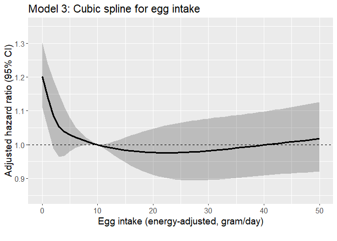
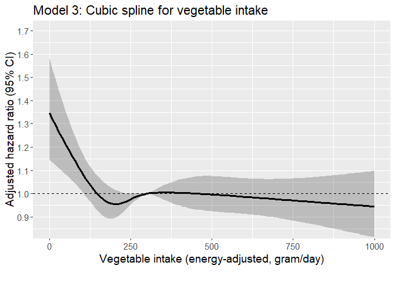

Egg dementia study
================

## Aim

- Association between egg intake and the incidence of
  dementia/Alzheimer’s disease in the AHS-2 cohort linked with Medicare
  data

## Datasets

- Medicare data
  - For details regarding Medicare data, see [AHS-2 Medicare
    Linkage](https://github.com/keijioda/ahs_medicare_linkage/blob/main/summary.md)
    repository.

  - Master Beneficiary Summary File (MBSF), 2008-2020

    - Contains beneficiary characteristics and enrollment information

  - Chronic Conditions file (CC), 2008-2020

    - Contains the first occurrence date of 27 specific chronic
      conditions
    - Used to identify prevalent/incident cases of dementia and/or
      Alzheimer’s disease and
    - to identify comorbidities

  - Both files include n = 44,585 unique subjects across years, after
    excluding

    - Gender/DOB mismatch with AHS-2 data
    - Dupulicate beneficiary IDs and SSNs
- AHS-2 baseline data with imputations: n = 88,051
  - Among this, n = 383 subjects were excluded because they opted out of
    the study
  - After removing opt-outs, there were n = 87,668 subjects
- After merging Medicare and AHS-2 data, there were n = 41,099 subjects.

## Inclusion/exclusion criteria

- Medicare beneficiaries who did not reach the age of 65 between 2008
  and 2020 (e.g., younger beneficiaries with disabilities or end-stage
  renal disease) were excluded (n = 1336), resulting n = 39,763.

- n = 82 subjects with extreme BMI (\<16 or \>60), according to AHS
  questionnaire, were excluded, resulting n = 39,681.

- Prevalent cases of dementia and/or Alzheimer’s disease

  - If the first diagnosis was made before AHS-2 enrollment or within 6
    months after the enrollment, consider it as a prevalent case
  - n = 377 such prevalent cases were excluded, resulting n = 39,304
    subjects

- Unverified dates of deaths

  - Medicare data include a variable (`VALID_DEATH_DT_SW`) indicating
    whether a beneficiary’s day of death has been verified by the Social
    Security Administration or the Railroad Retirement Board.
  - There were 19 unverified death dates. Excluding these resulted n =
    39,285.

## Dietary variables

- Gram intakes of 3 food groups (meat, fish, and dairy) were calculated
  (gram/day) according to AHS-2 food frequency questionnaire.

- For each food group, its dietary intake was energy-adjusted by the
  residual method, while partitioning zero intake ([Jaceldo-Siegl et
  al., 2011](https://www.ncbi.nlm.nih.gov/pmc/articles/PMC3433053/)).
  Due to its highly right-skewed distribution, non-zero intake was
  log-transformed before being regressed on the total energy intake.
  Residuals were added by the mean of log and then back-transformed to
  obtain energy-adjusted dietary intake. Energy-adjusted dietary intake
  was added with (unadjusted) supplement intake to form energy-adjuste
  total intake.

- Subjects were then divided into 4 intake levels.

  - For meat and fish, about 51% of subjects indicated zero intake and
    they were classified to a non-consumption group. The rest of the
    subjects were approximately equally allocated to 3 consumption
    groups according to their intake.
  - For other food group variables, subjects were divided into 4
    quartile groups.
  - For cut-off values of the four food groups, please see the
    descriptive table below.

- Mean and 25th, 50th, 75th percentiles of gram intake by intake group
  are shown below:

| meat_gram_ea_4 |     n |   pct |  mean |    p1 |    p2 |    p3 |
|:---------------|------:|------:|------:|------:|------:|------:|
| None           | 19697 | 50.14 |  0.00 |  0.00 |  0.00 |  0.00 |
| \<11 g/d       |  6576 | 16.74 |  5.76 |  3.87 |  5.70 |  7.61 |
| 11-\<32 g/d    |  6404 | 16.30 | 19.36 | 14.31 | 18.34 | 23.80 |
| 32+ g/d        |  6608 | 16.82 | 63.42 | 41.43 | 54.76 | 75.70 |

| fish_gram_ea_4 |     n |   pct |  mean |    p1 |    p2 |    p3 |
|:---------------|------:|------:|------:|------:|------:|------:|
| None           | 19220 | 48.92 |  0.00 |  0.00 |  0.00 |  0.00 |
| \<9 g/d        |  6572 | 16.73 |  5.56 |  4.14 |  5.50 |  7.06 |
| 9-\<18 g/d     |  6838 | 17.41 | 13.04 | 10.86 | 12.78 | 15.16 |
| 18+ g/d        |  6655 | 16.94 | 37.02 | 21.82 | 28.42 | 43.59 |

| alldairy2_gram_ea_4 |     n |   pct |   mean |     p1 |     p2 |     p3 |
|:--------------------|------:|------:|-------:|-------:|-------:|-------:|
| None                |  4878 | 12.42 |   0.00 |   0.00 |   0.00 |   0.00 |
| \<50 g/d            | 11784 | 30.00 |  21.46 |   9.50 |  19.78 |  32.78 |
| 50-\<180 g/d        | 11502 | 29.28 | 106.36 |  72.54 | 102.72 | 138.05 |
| 180+ g/d            | 11121 | 28.31 | 368.95 | 233.15 | 304.33 | 424.81 |

| nutsseeds_gram_ea_4 |     n |   pct |  mean |    p1 |    p2 |    p3 |
|:--------------------|------:|------:|------:|------:|------:|------:|
| \<9 g/d             |  9941 | 25.30 |  4.74 |  2.62 |  4.95 |  7.00 |
| 9-\<19 g/d          | 10270 | 26.14 | 13.78 | 11.30 | 13.62 | 16.24 |
| 19-\<33 g/d         |  9715 | 24.73 | 25.39 | 21.98 | 25.10 | 28.65 |
| 33+ g/d             |  9359 | 23.82 | 51.88 | 38.15 | 45.56 | 58.15 |

| totalveg_gram_ea_4 |    n |   pct |   mean |     p1 |     p2 |     p3 |
|:-------------------|-----:|------:|-------:|-------:|-------:|-------:|
| \<185 g/d          | 9986 | 25.42 | 127.53 |  99.54 | 134.27 | 161.68 |
| 185-\<270 g/d      | 9722 | 24.75 | 226.93 | 205.95 | 226.33 | 247.68 |
| 270-\<380 g/d      | 9878 | 25.14 | 320.66 | 293.58 | 318.49 | 346.64 |
| 380+ g/d           | 9699 | 24.69 | 536.28 | 423.07 | 482.12 | 584.60 |

| fruits_gram_ea_4 |    n |   pct |   mean |     p1 |     p2 |     p3 |
|:-----------------|-----:|------:|-------:|-------:|-------:|-------:|
| \<170 g/d        | 9889 | 25.17 | 102.16 |  69.40 | 107.64 | 139.63 |
| 170-\<280 g/d    | 9773 | 24.88 | 225.10 | 198.11 | 224.93 | 252.28 |
| 280-\<420 g/d    | 9831 | 25.02 | 344.38 | 309.25 | 341.64 | 378.08 |
| 420+ g/d         | 9792 | 24.93 | 617.05 | 472.46 | 546.86 | 684.20 |

| legumes_gram_ea_4 |     n |   pct |   mean |     p1 |     p2 |     p3 |
|:------------------|------:|------:|-------:|-------:|-------:|-------:|
| (-Inf,33\]        |  9677 | 24.63 |  16.63 |   8.59 |  17.38 |  25.56 |
| (33,60\]          |  9596 | 24.43 |  46.57 |  39.91 |  46.65 |  53.22 |
| (60,100\]         | 10346 | 26.34 |  77.69 |  67.90 |  76.58 |  86.79 |
| (100, Inf\]       |  9666 | 24.60 | 168.27 | 116.66 | 143.04 | 193.09 |

| refgrains_gram_ea_4 |     n |   pct |   mean |     p1 |     p2 |     p3 |
|:--------------------|------:|------:|-------:|-------:|-------:|-------:|
| \<40 g/d            | 10245 | 26.08 |  21.21 |  12.97 |  21.88 |  30.66 |
| 40-\<83 g/d         |  9913 | 25.23 |  60.32 |  49.65 |  59.53 |  70.86 |
| 83-\<150 g/d        |  9732 | 24.77 | 112.66 |  95.95 | 111.02 | 128.22 |
| 150+ g/d            |  9395 | 23.91 | 271.16 | 178.22 | 223.86 | 311.98 |

| whole_mixed_grains_gram_ea_4 |     n |   pct |   mean |     p1 |     p2 |     p3 |
|:-----------------------------|------:|------:|-------:|-------:|-------:|-------:|
| \<120 g/d                    | 10143 | 25.82 |  71.28 |  48.70 |  75.39 |  98.24 |
| 120-\<210 g/d                |  9616 | 24.48 | 162.57 | 140.22 | 161.40 | 184.00 |
| 210-\<350 g/d                |  9618 | 24.48 | 273.83 | 238.35 | 270.76 | 307.53 |
| 350+ g/d                     |  9908 | 25.22 | 520.48 | 403.24 | 475.29 | 592.58 |

- For egg intake and meat intake, a crosstab was produced:
  - The first table was stratified by meat intake (% of egg intake
    within each meat level)
  - The second table was stratified by egg intake (% of meat intake
    within each egg level)

|  | level | None | \<11 g/d | 11-\<32 g/d | 32+ g/d | p | test |
|:---|:---|:---|:---|:---|:---|:---|:---|
| n |  | 19697 | 6576 | 6404 | 6608 |  |  |
| egg_freq (%) | Never | 8484 (43.1) | 999 (15.2) | 599 ( 9.4) | 484 ( 7.3) | \<0.001 |  |
|  | 1-3/mo | 4829 (24.5) | 2045 (31.1) | 1855 (29.0) | 1403 (21.2) |  |  |
|  | 1/wk | 2770 (14.1) | 1397 (21.2) | 1392 (21.7) | 1350 (20.4) |  |  |
|  | 2-4/wk | 3103 (15.8) | 1775 (27.0) | 2075 (32.4) | 2504 (37.9) |  |  |
|  | 5+/wk | 511 ( 2.6) | 360 ( 5.5) | 483 ( 7.5) | 867 (13.1) |  |  |

|  | level | Never | 1-3/mo | 1/wk | 2-4/wk | 5+/wk | p | test |
|:---|:---|:---|:---|:---|:---|:---|:---|:---|
| n |  | 10566 | 10132 | 6909 | 9457 | 2221 |  |  |
| meat_gram_ea_4 (%) | None | 8484 (80.3) | 4829 (47.7) | 2770 (40.1) | 3103 (32.8) | 511 (23.0) | \<0.001 |  |
|  | \<11 g/d | 999 ( 9.5) | 2045 (20.2) | 1397 (20.2) | 1775 (18.8) | 360 (16.2) |  |  |
|  | 11-\<32 g/d | 599 ( 5.7) | 1855 (18.3) | 1392 (20.1) | 2075 (21.9) | 483 (21.7) |  |  |
|  | 32+ g/d | 484 ( 4.6) | 1403 (13.8) | 1350 (19.5) | 2504 (26.5) | 867 (39.0) |  |  |

## Descriptive table

- The descriptive table by case/non-case:
  - Age, gender, and race (RTI race code, recoded into
    White/Black/Other) were derived from Medicare MBSF data.
    - Age was calculated at the end of year 2020 (for the sake of
      comparison; some of the subjects may have died by then)
  - Other demographic and lifestyle variables were derived from AHS-2
    baseline questionnaire
    - Marital status (married, never married, widowed/divorced)
    - Education level (high school or less, some college, college
      graduate)
    - Dietary pattern (5 levels: vegan, lacto-ovo, semi, pesco and
      non-vegetarians)
    - BMI group
    - Exercise (none, low, moderate, vigorous)
    - Smoking (never/ever)
    - Alcohol use (never/ever)
    - Sleep hours
  - Comorbidity variables (yes/no) were derived from Medicare chronic
    condition data. Those who were diagnosed with the following
    conditions prior to study enrollment were flagged.
    - Cancer: breast, colorectal, lung, prostate, endometrial
    - CVD: Acute MI, atrial fibrillation, congestive heart failure,
      ischemic heart disease, stroke/TIA
    - Hypertension
    - hyperlipidemia
    - Respiratory diseases: COPD, asthma
    - Anemia
    - Diabetes
    - Chronic kidney diseases
    - Hypothyroidism
    - Depression
    - Functional disabilities: Cataract, glaucoma, hip/pelvic fracture,
      osteoporosis, rheumatoid arthritis/osteoarthritis
- For those diagnosed with dementia/AD, the mean age at diagnosis was
  83.3 years (median 84.0 years)

|  | level | Overall | Non-case | Case | p | test |
|:---|:---|:---|:---|:---|:---|:---|
| n |  | 39285 | 32519 | 6766 |  |  |
| agecat (%) | 65-69 | 6687 (17.0) | 6583 (20.2) | 104 ( 1.5) | \<0.001 |  |
|  | 70-74 | 6949 (17.7) | 6673 (20.5) | 276 ( 4.1) |  |  |
|  | 75-79 | 6291 (16.0) | 5777 (17.8) | 514 ( 7.6) |  |  |
|  | 80-84 | 5616 (14.3) | 4723 (14.5) | 893 (13.2) |  |  |
|  | 85-89 | 5010 (12.8) | 3727 (11.5) | 1283 (19.0) |  |  |
|  | 90-94 | 4219 (10.7) | 2642 ( 8.1) | 1577 (23.3) |  |  |
|  | 95+ | 4513 (11.5) | 2394 ( 7.4) | 2119 (31.3) |  |  |
| bene_age_at_end_2020 (mean (SD)) |  | 81.05 (10.43) | 79.13 (9.70) | 90.30 (8.74) | \<0.001 |  |
| age_medicare_cat (%) | \<50 | 619 ( 1.6) | 514 ( 1.6) | 105 ( 1.6) | \<0.001 |  |
|  | 50-54 | 475 ( 1.2) | 384 ( 1.2) | 91 ( 1.3) |  |  |
|  | 55-59 | 929 ( 2.4) | 755 ( 2.3) | 174 ( 2.6) |  |  |
|  | 60-63 | 946 ( 2.4) | 762 ( 2.3) | 184 ( 2.7) |  |  |
|  | 64 | 33373 (85.0) | 27628 (85.0) | 5745 (84.9) |  |  |
|  | 65 | 1684 ( 4.3) | 1485 ( 4.6) | 199 ( 2.9) |  |  |
|  | 66-69 | 1059 ( 2.7) | 853 ( 2.6) | 206 ( 3.0) |  |  |
|  | 70+ | 200 ( 0.5) | 138 ( 0.4) | 62 ( 0.9) |  |  |
| age_medicare_cont (mean (SD)) |  | 64.34 (3.53) | 64.34 (3.49) | 64.35 (3.73) | 0.738 |  |
| bene_sex_F (%) | M | 14251 (36.3) | 11926 (36.7) | 2325 (34.4) | \<0.001 |  |
|  | F | 25034 (63.7) | 20593 (63.3) | 4441 (65.6) |  |  |
| rti_race3 (%) | NH White | 29159 (74.2) | 23610 (72.6) | 5549 (82.0) | \<0.001 |  |
|  | Black | 7473 (19.0) | 6496 (20.0) | 977 (14.4) |  |  |
|  | Other | 2653 ( 6.8) | 2413 ( 7.4) | 240 ( 3.5) |  |  |
| marital (%) | Married | 28795 (73.3) | 24346 (74.9) | 4449 (65.8) | \<0.001 |  |
|  | Never | 1346 ( 3.4) | 1151 ( 3.5) | 195 ( 2.9) |  |  |
|  | Div/Wid | 9144 (23.3) | 7022 (21.6) | 2122 (31.4) |  |  |
| educyou (%) | HSch & below | 8429 (21.5) | 6616 (20.3) | 1813 (26.8) | \<0.001 |  |
|  | Some College | 15507 (39.5) | 12869 (39.6) | 2638 (39.0) |  |  |
|  | Bachelors + | 15349 (39.1) | 13034 (40.1) | 2315 (34.2) |  |  |
| vegstat (%) | Vegan | 3248 ( 8.3) | 2611 ( 8.0) | 637 ( 9.4) | \<0.001 |  |
|  | Lacto-ovo | 12673 (32.3) | 10272 (31.6) | 2401 (35.5) |  |  |
|  | Semi | 2231 ( 5.7) | 1854 ( 5.7) | 377 ( 5.6) |  |  |
|  | Pesco | 3792 ( 9.7) | 3112 ( 9.6) | 680 (10.1) |  |  |
|  | Non-veg | 17341 (44.1) | 14670 (45.1) | 2671 (39.5) |  |  |
| bmicat (%) | Normal | 15193 (38.7) | 12308 (37.8) | 2885 (42.6) | \<0.001 |  |
|  | Overweight | 14285 (36.4) | 11884 (36.5) | 2401 (35.5) |  |  |
|  | Obese | 9807 (25.0) | 8327 (25.6) | 1480 (21.9) |  |  |
| bmi (mean (SD)) |  | 27.21 (5.47) | 27.32 (5.49) | 26.70 (5.32) | \<0.001 |  |
| exercise (%) | None | 8683 (22.1) | 6623 (20.4) | 2060 (30.4) | \<0.001 |  |
|  | ≤0.5 hrs/wk | 9572 (24.4) | 8198 (25.2) | 1374 (20.3) |  |  |
|  | 0.5\<-2 hrs/wk | 10323 (26.3) | 8722 (26.8) | 1601 (23.7) |  |  |
|  | \>2 hrs/wk | 10707 (27.3) | 8976 (27.6) | 1731 (25.6) |  |  |
| sleephrs (%) | \<= 5 hrs | 3893 ( 9.9) | 3267 (10.0) | 626 ( 9.3) | \<0.001 |  |
|  | 6 hrs | 8559 (21.8) | 7216 (22.2) | 1343 (19.8) |  |  |
|  | 7 hrs | 14225 (36.2) | 12020 (37.0) | 2205 (32.6) |  |  |
|  | 8 hrs | 10386 (26.4) | 8331 (25.6) | 2055 (30.4) |  |  |
|  | \>= 9 hrs | 2222 ( 5.7) | 1685 ( 5.2) | 537 ( 7.9) |  |  |
| smokecat (%) | Never | 31245 (79.5) | 25758 (79.2) | 5487 (81.1) | \<0.001 |  |
|  | Ever | 8040 (20.5) | 6761 (20.8) | 1279 (18.9) |  |  |
| alccat (%) | Never | 27706 (70.5) | 22555 (69.4) | 5151 (76.1) | \<0.001 |  |
|  | Ever | 11579 (29.5) | 9964 (30.6) | 1615 (23.9) |  |  |
| como_depress (%) | No | 37800 (96.2) | 31672 (97.4) | 6128 (90.6) | \<0.001 |  |
|  | Yes | 1485 ( 3.8) | 847 ( 2.6) | 638 ( 9.4) |  |  |
| como_disab (%) | No | 29751 (75.7) | 26851 (82.6) | 2900 (42.9) | \<0.001 |  |
|  | Yes | 9534 (24.3) | 5668 (17.4) | 3866 (57.1) |  |  |
| como_diabetes (%) | No | 36973 (94.1) | 31080 (95.6) | 5893 (87.1) | \<0.001 |  |
|  | Yes | 2312 ( 5.9) | 1439 ( 4.4) | 873 (12.9) |  |  |
| como_cvd (%) | No | 34394 (87.5) | 29655 (91.2) | 4739 (70.0) | \<0.001 |  |
|  | Yes | 4891 (12.5) | 2864 ( 8.8) | 2027 (30.0) |  |  |
| como_hypert (%) | No | 32502 (82.7) | 28451 (87.5) | 4051 (59.9) | \<0.001 |  |
|  | Yes | 6783 (17.3) | 4068 (12.5) | 2715 (40.1) |  |  |
| como_hyperl (%) | No | 33199 (84.5) | 28749 (88.4) | 4450 (65.8) | \<0.001 |  |
|  | Yes | 6086 (15.5) | 3770 (11.6) | 2316 (34.2) |  |  |
| como_resp (%) | No | 37693 (95.9) | 31559 (97.0) | 6134 (90.7) | \<0.001 |  |
|  | Yes | 1592 ( 4.1) | 960 ( 3.0) | 632 ( 9.3) |  |  |
| como_anemia (%) | No | 35659 (90.8) | 30401 (93.5) | 5258 (77.7) | \<0.001 |  |
|  | Yes | 3626 ( 9.2) | 2118 ( 6.5) | 1508 (22.3) |  |  |
| como_kidney (%) | No | 38784 (98.7) | 32213 (99.1) | 6571 (97.1) | \<0.001 |  |
|  | Yes | 501 ( 1.3) | 306 ( 0.9) | 195 ( 2.9) |  |  |
| como_hypoth (%) | No | 36777 (93.6) | 31068 (95.5) | 5709 (84.4) | \<0.001 |  |
|  | Yes | 2508 ( 6.4) | 1451 ( 4.5) | 1057 (15.6) |  |  |
| como_cancers (%) | No | 37921 (96.5) | 31680 (97.4) | 6241 (92.2) | \<0.001 |  |
|  | Yes | 1364 ( 3.5) | 839 ( 2.6) | 525 ( 7.8) |  |  |
| egg_freq (%) | Never | 10566 (26.9) | 8497 (26.1) | 2069 (30.6) | \<0.001 |  |
|  | 1-3/mo | 10132 (25.8) | 8466 (26.0) | 1666 (24.6) |  |  |
|  | 1/wk | 6909 (17.6) | 5810 (17.9) | 1099 (16.2) |  |  |
|  | 2-4/wk | 9457 (24.1) | 7884 (24.2) | 1573 (23.2) |  |  |
|  | 5+/wk | 2221 ( 5.7) | 1862 ( 5.7) | 359 ( 5.3) |  |  |
| meat_gram_ea_4 (%) | None | 19697 (50.1) | 15981 (49.1) | 3716 (54.9) | \<0.001 |  |
|  | \<11 g/d | 6576 (16.7) | 5405 (16.6) | 1171 (17.3) |  |  |
|  | 11-\<32 g/d | 6404 (16.3) | 5389 (16.6) | 1015 (15.0) |  |  |
|  | 32+ g/d | 6608 (16.8) | 5744 (17.7) | 864 (12.8) |  |  |
| fish_gram_ea_4 (%) | None | 19220 (48.9) | 15626 (48.1) | 3594 (53.1) | \<0.001 |  |
|  | \<9 g/d | 6572 (16.7) | 5369 (16.5) | 1203 (17.8) |  |  |
|  | 9-\<18 g/d | 6838 (17.4) | 5769 (17.7) | 1069 (15.8) |  |  |
|  | 18+ g/d | 6655 (16.9) | 5755 (17.7) | 900 (13.3) |  |  |
| alldairy2_gram_ea_4 (%) | None | 4878 (12.4) | 3937 (12.1) | 941 (13.9) | \<0.001 |  |
|  | \<50 g/d | 11784 (30.0) | 9751 (30.0) | 2033 (30.0) |  |  |
|  | 50-\<180 g/d | 11502 (29.3) | 9658 (29.7) | 1844 (27.3) |  |  |
|  | 180+ g/d | 11121 (28.3) | 9173 (28.2) | 1948 (28.8) |  |  |
| totalveg_gram_ea_4 (%) | \<185 g/d | 9986 (25.4) | 8312 (25.6) | 1674 (24.7) | 0.408 |  |
|  | 185-\<270 g/d | 9722 (24.7) | 8037 (24.7) | 1685 (24.9) |  |  |
|  | 270-\<380 g/d | 9878 (25.1) | 8134 (25.0) | 1744 (25.8) |  |  |
|  | 380+ g/d | 9699 (24.7) | 8036 (24.7) | 1663 (24.6) |  |  |
| fruits_gram_ea_4 (%) | \<170 g/d | 9889 (25.2) | 8450 (26.0) | 1439 (21.3) | \<0.001 |  |
|  | 170-\<280 g/d | 9773 (24.9) | 8155 (25.1) | 1618 (23.9) |  |  |
|  | 280-\<420 g/d | 9831 (25.0) | 7995 (24.6) | 1836 (27.1) |  |  |
|  | 420+ g/d | 9792 (24.9) | 7919 (24.4) | 1873 (27.7) |  |  |
| refgrains_gram_ea_4 (%) | \<40 g/d | 10245 (26.1) | 8099 (24.9) | 2146 (31.7) | \<0.001 |  |
|  | 40-\<83 g/d | 9913 (25.2) | 8148 (25.1) | 1765 (26.1) |  |  |
|  | 83-\<150 g/d | 9732 (24.8) | 8238 (25.3) | 1494 (22.1) |  |  |
|  | 150+ g/d | 9395 (23.9) | 8034 (24.7) | 1361 (20.1) |  |  |
| whole_mixed_grains_gram_ea_4 (%) | \<120 g/d | 10143 (25.8) | 8654 (26.6) | 1489 (22.0) | \<0.001 |  |
|  | 120-\<210 g/d | 9616 (24.5) | 7977 (24.5) | 1639 (24.2) |  |  |
|  | 210-\<350 g/d | 9618 (24.5) | 7889 (24.3) | 1729 (25.6) |  |  |
|  | 350+ g/d | 9908 (25.2) | 7999 (24.6) | 1909 (28.2) |  |  |
| nutsseeds_gram_ea_4 (%) | \<9 g/d | 9941 (25.3) | 8440 (26.0) | 1501 (22.2) | \<0.001 |  |
|  | 9-\<19 g/d | 10270 (26.1) | 8591 (26.4) | 1679 (24.8) |  |  |
|  | 19-\<33 g/d | 9715 (24.7) | 8000 (24.6) | 1715 (25.3) |  |  |
|  | 33+ g/d | 9359 (23.8) | 7488 (23.0) | 1871 (27.7) |  |  |
| legumes_gram_ea_4 (%) | (-Inf,33\] | 9677 (24.6) | 7977 (24.5) | 1700 (25.1) | 0.001 |  |
|  | (33,60\] | 9596 (24.4) | 7834 (24.1) | 1762 (26.0) |  |  |
|  | (60,100\] | 10346 (26.3) | 8619 (26.5) | 1727 (25.5) |  |  |
|  | (100, Inf\] | 9666 (24.6) | 8089 (24.9) | 1577 (23.3) |  |  |

## Descriptive table by egg intake

|  | level | Overall | Never | 1-3/mo | 1/wk | 2-4/wk | 5+/wk | p | test |
|:---|:---|:---|:---|:---|:---|:---|:---|:---|:---|
| n |  | 39285 | 10566 | 10132 | 6909 | 9457 | 2221 |  |  |
| ALZH_DEMEN_YN2 (%) | Non-case | 32519 (82.8) | 8497 (80.4) | 8466 (83.6) | 5810 (84.1) | 7884 (83.4) | 1862 (83.8) | \<0.001 |  |
|  | Case | 6766 (17.2) | 2069 (19.6) | 1666 (16.4) | 1099 (15.9) | 1573 (16.6) | 359 (16.2) |  |  |
| agecat (%) | 65-69 | 6687 (17.0) | 1646 (15.6) | 1821 (18.0) | 1202 (17.4) | 1627 (17.2) | 391 (17.6) | \<0.001 |  |
|  | 70-74 | 6949 (17.7) | 1797 (17.0) | 1836 (18.1) | 1258 (18.2) | 1660 (17.6) | 398 (17.9) |  |  |
|  | 75-79 | 6291 (16.0) | 1672 (15.8) | 1670 (16.5) | 1089 (15.8) | 1463 (15.5) | 397 (17.9) |  |  |
|  | 80-84 | 5616 (14.3) | 1529 (14.5) | 1413 (13.9) | 961 (13.9) | 1385 (14.6) | 328 (14.8) |  |  |
|  | 85-89 | 5010 (12.8) | 1374 (13.0) | 1261 (12.4) | 907 (13.1) | 1195 (12.6) | 273 (12.3) |  |  |
|  | 90-94 | 4219 (10.7) | 1218 (11.5) | 1025 (10.1) | 716 (10.4) | 1032 (10.9) | 228 (10.3) |  |  |
|  | 95+ | 4513 (11.5) | 1330 (12.6) | 1106 (10.9) | 776 (11.2) | 1095 (11.6) | 206 ( 9.3) |  |  |
| bene_age_at_end_2020 (mean (SD)) |  | 81.05 (10.43) | 81.64 (10.53) | 80.65 (10.36) | 80.89 (10.41) | 81.10 (10.47) | 80.37 (10.04) | \<0.001 |  |
| bene_sex_F (%) | M | 14251 (36.3) | 3752 (35.5) | 3350 (33.1) | 2727 (39.5) | 3495 (37.0) | 927 (41.7) | \<0.001 |  |
|  | F | 25034 (63.7) | 6814 (64.5) | 6782 (66.9) | 4182 (60.5) | 5962 (63.0) | 1294 (58.3) |  |  |
| rti_race3 (%) | NH White | 29159 (74.2) | 7722 (73.1) | 7164 (70.7) | 5284 (76.5) | 7196 (76.1) | 1793 (80.7) | \<0.001 |  |
|  | Black | 7473 (19.0) | 2194 (20.8) | 2249 (22.2) | 1099 (15.9) | 1618 (17.1) | 313 (14.1) |  |  |
|  | Other | 2653 ( 6.8) | 650 ( 6.2) | 719 ( 7.1) | 526 ( 7.6) | 643 ( 6.8) | 115 ( 5.2) |  |  |
| marital (%) | Married | 28795 (73.3) | 7669 (72.6) | 7183 (70.9) | 5341 (77.3) | 6988 (73.9) | 1614 (72.7) | \<0.001 |  |
|  | Never | 1346 ( 3.4) | 423 ( 4.0) | 385 ( 3.8) | 181 ( 2.6) | 297 ( 3.1) | 60 ( 2.7) |  |  |
|  | Div/Wid | 9144 (23.3) | 2474 (23.4) | 2564 (25.3) | 1387 (20.1) | 2172 (23.0) | 547 (24.6) |  |  |
| educyou (%) | HSch & below | 8429 (21.5) | 2112 (20.0) | 2314 (22.8) | 1385 (20.0) | 2075 (21.9) | 543 (24.4) | \<0.001 |  |
|  | Some College | 15507 (39.5) | 4029 (38.1) | 3963 (39.1) | 2678 (38.8) | 3877 (41.0) | 960 (43.2) |  |  |
|  | Bachelors + | 15349 (39.1) | 4425 (41.9) | 3855 (38.0) | 2846 (41.2) | 3505 (37.1) | 718 (32.3) |  |  |
| vegstat (%) | Vegan | 3248 ( 8.3) | 3248 (30.7) | 0 ( 0.0) | 0 ( 0.0) | 0 ( 0.0) | 0 ( 0.0) | \<0.001 |  |
|  | Lacto-ovo | 12673 (32.3) | 4159 (39.4) | 3762 (37.1) | 2113 (30.6) | 2266 (24.0) | 373 (16.8) |  |  |
|  | Semi | 2231 ( 5.7) | 400 ( 3.8) | 734 ( 7.2) | 467 ( 6.8) | 538 ( 5.7) | 92 ( 4.1) |  |  |
|  | Pesco | 3792 ( 9.7) | 1081 (10.2) | 1071 (10.6) | 660 ( 9.6) | 840 ( 8.9) | 140 ( 6.3) |  |  |
|  | Non-veg | 17341 (44.1) | 1678 (15.9) | 4565 (45.1) | 3669 (53.1) | 5813 (61.5) | 1616 (72.8) |  |  |
| bmicat (%) | Normal | 15193 (38.7) | 5549 (52.5) | 3835 (37.9) | 2485 (36.0) | 2810 (29.7) | 514 (23.1) | \<0.001 |  |
|  | Overweight | 14285 (36.4) | 3324 (31.5) | 3818 (37.7) | 2693 (39.0) | 3657 (38.7) | 793 (35.7) |  |  |
|  | Obese | 9807 (25.0) | 1693 (16.0) | 2479 (24.5) | 1731 (25.1) | 2990 (31.6) | 914 (41.2) |  |  |
| bmi (mean (SD)) |  | 27.21 (5.47) | 25.59 (4.95) | 27.25 (5.37) | 27.41 (5.31) | 28.31 (5.61) | 29.45 (5.98) | \<0.001 |  |
| exercise (%) | None | 8683 (22.1) | 2078 (19.7) | 2288 (22.6) | 1449 (21.0) | 2241 (23.7) | 627 (28.2) | \<0.001 |  |
|  | ≤0.5 hrs/wk | 9572 (24.4) | 2208 (20.9) | 2500 (24.7) | 1837 (26.6) | 2482 (26.2) | 545 (24.5) |  |  |
|  | 0.5\<-2 hrs/wk | 10323 (26.3) | 2826 (26.7) | 2656 (26.2) | 1837 (26.6) | 2483 (26.3) | 521 (23.5) |  |  |
|  | \>2 hrs/wk | 10707 (27.3) | 3454 (32.7) | 2688 (26.5) | 1786 (25.9) | 2251 (23.8) | 528 (23.8) |  |  |
| sleephrs (%) | \<= 5 hrs | 3893 ( 9.9) | 998 ( 9.4) | 1077 (10.6) | 629 ( 9.1) | 958 (10.1) | 231 (10.4) | \<0.001 |  |
|  | 6 hrs | 8559 (21.8) | 2232 (21.1) | 2372 (23.4) | 1442 (20.9) | 2020 (21.4) | 493 (22.2) |  |  |
|  | 7 hrs | 14225 (36.2) | 3856 (36.5) | 3561 (35.1) | 2619 (37.9) | 3439 (36.4) | 750 (33.8) |  |  |
|  | 8 hrs | 10386 (26.4) | 2899 (27.4) | 2558 (25.2) | 1849 (26.8) | 2481 (26.2) | 599 (27.0) |  |  |
|  | \>= 9 hrs | 2222 ( 5.7) | 581 ( 5.5) | 564 ( 5.6) | 370 ( 5.4) | 559 ( 5.9) | 148 ( 6.7) |  |  |
| smokecat (%) | Never | 31245 (79.5) | 8705 (82.4) | 8113 (80.1) | 5553 (80.4) | 7289 (77.1) | 1585 (71.4) | \<0.001 |  |
|  | Ever | 8040 (20.5) | 1861 (17.6) | 2019 (19.9) | 1356 (19.6) | 2168 (22.9) | 636 (28.6) |  |  |
| alccat (%) | Never | 27706 (70.5) | 7928 (75.0) | 7241 (71.5) | 4837 (70.0) | 6368 (67.3) | 1332 (60.0) | \<0.001 |  |
|  | Ever | 11579 (29.5) | 2638 (25.0) | 2891 (28.5) | 2072 (30.0) | 3089 (32.7) | 889 (40.0) |  |  |
| como_depress (%) | No | 37800 (96.2) | 10183 (96.4) | 9754 (96.3) | 6672 (96.6) | 9065 (95.9) | 2126 (95.7) | 0.089 |  |
|  | Yes | 1485 ( 3.8) | 383 ( 3.6) | 378 ( 3.7) | 237 ( 3.4) | 392 ( 4.1) | 95 ( 4.3) |  |  |
| como_disab (%) | No | 29751 (75.7) | 7855 (74.3) | 7783 (76.8) | 5288 (76.5) | 7128 (75.4) | 1697 (76.4) | \<0.001 |  |
|  | Yes | 9534 (24.3) | 2711 (25.7) | 2349 (23.2) | 1621 (23.5) | 2329 (24.6) | 524 (23.6) |  |  |
| como_diabetes (%) | No | 36973 (94.1) | 10085 (95.4) | 9584 (94.6) | 6489 (93.9) | 8782 (92.9) | 2033 (91.5) | \<0.001 |  |
|  | Yes | 2312 ( 5.9) | 481 ( 4.6) | 548 ( 5.4) | 420 ( 6.1) | 675 ( 7.1) | 188 ( 8.5) |  |  |
| como_cvd (%) | No | 34394 (87.5) | 9244 (87.5) | 8896 (87.8) | 6063 (87.8) | 8256 (87.3) | 1935 (87.1) | 0.772 |  |
|  | Yes | 4891 (12.5) | 1322 (12.5) | 1236 (12.2) | 846 (12.2) | 1201 (12.7) | 286 (12.9) |  |  |
| como_hypert (%) | No | 32502 (82.7) | 8952 (84.7) | 8392 (82.8) | 5718 (82.8) | 7639 (80.8) | 1801 (81.1) | \<0.001 |  |
|  | Yes | 6783 (17.3) | 1614 (15.3) | 1740 (17.2) | 1191 (17.2) | 1818 (19.2) | 420 (18.9) |  |  |
| como_hyperl (%) | No | 33199 (84.5) | 9005 (85.2) | 8561 (84.5) | 5829 (84.4) | 7918 (83.7) | 1886 (84.9) | 0.062 |  |
|  | Yes | 6086 (15.5) | 1561 (14.8) | 1571 (15.5) | 1080 (15.6) | 1539 (16.3) | 335 (15.1) |  |  |
| como_resp (%) | No | 37693 (95.9) | 10192 (96.5) | 9760 (96.3) | 6625 (95.9) | 9011 (95.3) | 2105 (94.8) | \<0.001 |  |
|  | Yes | 1592 ( 4.1) | 374 ( 3.5) | 372 ( 3.7) | 284 ( 4.1) | 446 ( 4.7) | 116 ( 5.2) |  |  |
| como_anemia (%) | No | 35659 (90.8) | 9548 (90.4) | 9230 (91.1) | 6309 (91.3) | 8548 (90.4) | 2024 (91.1) | 0.099 |  |
|  | Yes | 3626 ( 9.2) | 1018 ( 9.6) | 902 ( 8.9) | 600 ( 8.7) | 909 ( 9.6) | 197 ( 8.9) |  |  |
| como_kidney (%) | No | 38784 (98.7) | 10457 (99.0) | 10011 (98.8) | 6825 (98.8) | 9308 (98.4) | 2183 (98.3) | 0.003 |  |
|  | Yes | 501 ( 1.3) | 109 ( 1.0) | 121 ( 1.2) | 84 ( 1.2) | 149 ( 1.6) | 38 ( 1.7) |  |  |
| como_hypoth (%) | No | 36777 (93.6) | 9912 (93.8) | 9497 (93.7) | 6464 (93.6) | 8817 (93.2) | 2087 (94.0) | 0.445 |  |
|  | Yes | 2508 ( 6.4) | 654 ( 6.2) | 635 ( 6.3) | 445 ( 6.4) | 640 ( 6.8) | 134 ( 6.0) |  |  |
| como_cancers (%) | No | 37921 (96.5) | 10189 (96.4) | 9780 (96.5) | 6700 (97.0) | 9103 (96.3) | 2149 (96.8) | 0.145 |  |
|  | Yes | 1364 ( 3.5) | 377 ( 3.6) | 352 ( 3.5) | 209 ( 3.0) | 354 ( 3.7) | 72 ( 3.2) |  |  |
| meat_gram_ea_4 (%) | None | 19697 (50.1) | 8484 (80.3) | 4829 (47.7) | 2770 (40.1) | 3103 (32.8) | 511 (23.0) | \<0.001 |  |
|  | \<11 g/d | 6576 (16.7) | 999 ( 9.5) | 2045 (20.2) | 1397 (20.2) | 1775 (18.8) | 360 (16.2) |  |  |
|  | 11-\<32 g/d | 6404 (16.3) | 599 ( 5.7) | 1855 (18.3) | 1392 (20.1) | 2075 (21.9) | 483 (21.7) |  |  |
|  | 32+ g/d | 6608 (16.8) | 484 ( 4.6) | 1403 (13.8) | 1350 (19.5) | 2504 (26.5) | 867 (39.0) |  |  |
| fish_gram_ea_4 (%) | None | 19220 (48.9) | 7939 (75.1) | 4764 (47.0) | 2738 (39.6) | 3180 (33.6) | 599 (27.0) | \<0.001 |  |
|  | \<9 g/d | 6572 (16.7) | 1019 ( 9.6) | 1887 (18.6) | 1299 (18.8) | 1852 (19.6) | 515 (23.2) |  |  |
|  | 9-\<18 g/d | 6838 (17.4) | 807 ( 7.6) | 1859 (18.3) | 1449 (21.0) | 2183 (23.1) | 540 (24.3) |  |  |
|  | 18+ g/d | 6655 (16.9) | 801 ( 7.6) | 1622 (16.0) | 1423 (20.6) | 2242 (23.7) | 567 (25.5) |  |  |
| alldairy2_gram_ea_4 (%) | None | 4878 (12.4) | 3956 (37.4) | 506 ( 5.0) | 186 ( 2.7) | 187 ( 2.0) | 43 ( 1.9) | \<0.001 |  |
|  | \<50 g/d | 11784 (30.0) | 4014 (38.0) | 3604 (35.6) | 1728 (25.0) | 2003 (21.2) | 435 (19.6) |  |  |
|  | 50-\<180 g/d | 11502 (29.3) | 1540 (14.6) | 3230 (31.9) | 2447 (35.4) | 3472 (36.7) | 813 (36.6) |  |  |
|  | 180+ g/d | 11121 (28.3) | 1056 (10.0) | 2792 (27.6) | 2548 (36.9) | 3795 (40.1) | 930 (41.9) |  |  |
| totalveg_gram_ea_4 (%) | \<185 g/d | 9986 (25.4) | 2092 (19.8) | 2757 (27.2) | 1773 (25.7) | 2618 (27.7) | 746 (33.6) | \<0.001 |  |
|  | 185-\<270 g/d | 9722 (24.7) | 2352 (22.3) | 2468 (24.4) | 1823 (26.4) | 2538 (26.8) | 541 (24.4) |  |  |
|  | 270-\<380 g/d | 9878 (25.1) | 2677 (25.3) | 2554 (25.2) | 1767 (25.6) | 2385 (25.2) | 495 (22.3) |  |  |
|  | 380+ g/d | 9699 (24.7) | 3445 (32.6) | 2353 (23.2) | 1546 (22.4) | 1916 (20.3) | 439 (19.8) |  |  |
| fruits_gram_ea_4 (%) | \<170 g/d | 9889 (25.2) | 1556 (14.7) | 2517 (24.8) | 1819 (26.3) | 3027 (32.0) | 970 (43.7) | \<0.001 |  |
|  | 170-\<280 g/d | 9773 (24.9) | 2106 (19.9) | 2475 (24.4) | 1875 (27.1) | 2758 (29.2) | 559 (25.2) |  |  |
|  | 280-\<420 g/d | 9831 (25.0) | 2918 (27.6) | 2526 (24.9) | 1796 (26.0) | 2172 (23.0) | 419 (18.9) |  |  |
|  | 420+ g/d | 9792 (24.9) | 3986 (37.7) | 2614 (25.8) | 1419 (20.5) | 1500 (15.9) | 273 (12.3) |  |  |
| refgrains_gram_ea_4 (%) | \<40 g/d | 10245 (26.1) | 3901 (36.9) | 2461 (24.3) | 1395 (20.2) | 1939 (20.5) | 549 (24.7) | \<0.001 |  |
|  | 40-\<83 g/d | 9913 (25.2) | 2474 (23.4) | 2588 (25.5) | 1825 (26.4) | 2430 (25.7) | 596 (26.8) |  |  |
|  | 83-\<150 g/d | 9732 (24.8) | 2110 (20.0) | 2641 (26.1) | 1894 (27.4) | 2530 (26.8) | 557 (25.1) |  |  |
|  | 150+ g/d | 9395 (23.9) | 2081 (19.7) | 2442 (24.1) | 1795 (26.0) | 2558 (27.0) | 519 (23.4) |  |  |
| whole_mixed_grains_gram_ea_4 (%) | \<120 g/d | 10143 (25.8) | 1578 (14.9) | 2655 (26.2) | 1954 (28.3) | 2988 (31.6) | 968 (43.6) | \<0.001 |  |
|  | 120-\<210 g/d | 9616 (24.5) | 1947 (18.4) | 2545 (25.1) | 1886 (27.3) | 2668 (28.2) | 570 (25.7) |  |  |
|  | 210-\<350 g/d | 9618 (24.5) | 2893 (27.4) | 2369 (23.4) | 1645 (23.8) | 2281 (24.1) | 430 (19.4) |  |  |
|  | 350+ g/d | 9908 (25.2) | 4148 (39.3) | 2563 (25.3) | 1424 (20.6) | 1520 (16.1) | 253 (11.4) |  |  |
| nutsseeds_gram_ea_4 (%) | \<9 g/d | 9941 (25.3) | 2011 (19.0) | 2757 (27.2) | 1754 (25.4) | 2641 (27.9) | 778 (35.0) | \<0.001 |  |
|  | 9-\<19 g/d | 10270 (26.1) | 2252 (21.3) | 2717 (26.8) | 1904 (27.6) | 2796 (29.6) | 601 (27.1) |  |  |
|  | 19-\<33 g/d | 9715 (24.7) | 2766 (26.2) | 2370 (23.4) | 1809 (26.2) | 2296 (24.3) | 474 (21.3) |  |  |
|  | 33+ g/d | 9359 (23.8) | 3537 (33.5) | 2288 (22.6) | 1442 (20.9) | 1724 (18.2) | 368 (16.6) |  |  |
| legumes_gram_ea_4 (%) | (-Inf,33\] | 9677 (24.6) | 1885 (17.8) | 2531 (25.0) | 1677 (24.3) | 2747 (29.0) | 837 (37.7) | \<0.001 |  |
|  | (33,60\] | 9596 (24.4) | 2224 (21.0) | 2498 (24.7) | 1780 (25.8) | 2496 (26.4) | 598 (26.9) |  |  |
|  | (60,100\] | 10346 (26.3) | 2952 (27.9) | 2677 (26.4) | 1939 (28.1) | 2323 (24.6) | 455 (20.5) |  |  |
|  | (100, Inf\] | 9666 (24.6) | 3505 (33.2) | 2426 (23.9) | 1513 (21.9) | 1891 (20.0) | 331 (14.9) |  |  |

- A descriptive table of age at diagnosis by egg intake among cases is
  shown below:

|  | level | Overall | Never | 1-3/mo | 1/wk | 2-4/wk | 5+/wk | p | test |
|:---|:---|:---|:---|:---|:---|:---|:---|:---|:---|
| n |  | 6766 | 2069 | 1666 | 1099 | 1573 | 359 |  |  |
| age_at_dx (mean (SD)) |  | 83.25 (8.18) | 83.42 (8.12) | 83.14 (8.26) | 83.42 (8.05) | 83.31 (8.31) | 82.09 (7.98) | 0.061 |  |

## Cox models

- To examine risk factors associated with incident dementia/AD, we
  employed the Cox proportional hazards model with attained age as the
  time scale
  - Age at entry was calculated based on the return date of AHS-2
    questionnaire
  - Those who died during the follow-up were censored at the date of
    death verified in Medicare data
  - Those who were diagnosed with dementia or Alzheimer’s disease after
    6 months following study enrollment were identified as incident
    cases and their age at diagnosis was calculated.
    - The mean follow-up years was 14.8 years (median 16.5 years)
  - The main exposure variable of interest was the frequency of egg
    intake.
    - In the AHS-2 baseline questionnaire, the frequency of egg intake
      was measured in 9 categories, as shown in “Dietary variables”
      section above.
    - Based on its distribution, egg frequency was re-categorized into 5
      groups (see the “Descriptive table” section)
  - Other food group variables were categorized into 4 intake group, as
    descrived in “Dietary variable.” section.
- Table XX:
  - Unadjusted hazard ratio (HR) is shown in the first column of Table
    XX for each covariate
  - ~~Multivariable model 1 includes all covariates except for total
    energy intake (Unit: per 100 kcal/day) and 4 food group vairables~~
  - ~~In Multivariable model 2, dietary pattern was removed and all 4
    food group variables were added, while also adjusting for total
    energy intake.~~
- Trend p-values were displayed for ordinal variables (education, BMI
  categories, exercise, sleep hours and food group intakes) in
  multivariable models.
- The proportional hazards assumption was assessed with visual
  inspection of plots of the scaled Schoenfeld residuals for each
  covariate. None of the covariates showed severe violation of the
  assumption.

## Cox models with cubic spline terms for food group variables

- In the Cox models above:
  - Five categories of egg frequency were used.
  - Other food group variables were categorized into 4 intake groups.
- Instead of using these dietary variables as categorical,
  energy-adjusted gram weights of intake were entered into the models as
  continuous. Since the previous Cox models suggest a non-linear
  association between egg intake and our disease outcome, restricted
  cubic spline of energy-adjusted egg intake (gram/day) was used to
  model the nonlinearity. For other food groups, restricted cubic
  splines were employed if there is a statistically significant
  non-linear term; otherwise only the linear term was entered into the
  model.
  - The number of knots in the cubic splines was set to 5 knots.
- For each those dietary variables that indicate a non-linear
  association, a plot of adjusted hazard ratio was produced to visualize
  how HR changes over a range of intake.
  - For eggs, an intake of 10 gram/day was chosen to be its reference
    value of the HR plot.
  - Total vegetable intake was another dietary variable showing a
    significant non-linearity. Its reference value was set to 300
    gram/day.
  - HR plots from the final model were shown below:

<!-- --><!-- -->

- Tables below shows adjusted HR for some representative values of egg
  gram intake (reference = 10 gram/day).

| eggs_gram_ea |   HR | lower | upper |
|-------------:|-----:|------:|------:|
|            0 | 1.20 |  1.11 |  1.30 |
|           20 | 0.98 |  0.91 |  1.05 |
|           30 | 0.98 |  0.90 |  1.08 |
|           40 | 1.00 |  0.91 |  1.10 |
|           50 | 1.02 |  0.92 |  1.13 |

- Tables below shows adjusted HR for some representative values of
  vegetable gram intake (reference = 300 gram/day).

| totalveg_gram_ea |   HR | lower | upper |
|-----------------:|-----:|------:|------:|
|               50 | 1.21 |  1.08 |  1.36 |
|              100 | 1.09 |  1.01 |  1.18 |
|              200 | 0.95 |  0.89 |  1.02 |
|              400 | 1.00 |  0.95 |  1.06 |
|              800 | 0.97 |  0.87 |  1.07 |

## Supplementary analysis

### Comparison of egg intake at baseline and at HHF6 questionnaire

- Frequency of egg intake was compared between the baseline
  questionnaire and HHF version 6
  - In HHF6, the frequency of egg intake was asked in the same format as
    in the baseline questionnaire (9 options)
  - Among our analytic sample, there are n = 23,843 subjects (60.7%) who
    returned HHF6 questionnaire
  - After excluding n = 741 invalid responses on egg frequency, there
    were n = 23,102 in the crosstab below
  - (Columns are egg frequency at baseline; Rows are from HHF6)
- The percentage of exact agreement (# in the main diagonals / total)
  was 39%. The percent of adjacent agreement (including those one
  above/below the main diagonals as agreement) was 74%. The Fleiss-Cohen
  weighted Kappa was 0.46.

|          | Never | 1-3x/mo | 1x/wk | 2-4x/wk | 5-6x/wk | 1x/day | 2-3x/day | 4-5x/day | 6+x/day |
|:---------|------:|--------:|------:|--------:|--------:|-------:|---------:|---------:|--------:|
| Never    |  3129 |     832 |   314 |     299 |      37 |     21 |        8 |        0 |       1 |
| 1-3x/mo  |  1430 |    1799 |   773 |     658 |      64 |     36 |       10 |        0 |       0 |
| 1x/wk    |   779 |    1417 |  1186 |    1074 |      77 |     32 |       15 |        1 |       0 |
| 2-4x/wk  |   706 |    1512 |  1567 |    2650 |     328 |    108 |       50 |        4 |       0 |
| 5-6x/wk  |    90 |     166 |   210 |     471 |     110 |     40 |       16 |        1 |       0 |
| 1x/day   |    78 |     115 |   108 |     277 |      69 |     66 |       23 |        0 |       0 |
| 2-3x/day |    29 |      35 |    47 |     102 |      36 |     24 |       41 |        1 |       3 |
| 4-5x/day |     3 |       3 |     3 |       3 |       2 |      1 |        0 |        1 |       0 |
| 6+x/day  |     2 |       1 |     1 |       4 |       1 |      2 |        0 |        0 |       0 |

## Notes for additional analyses

- ~~Combine semi- and non-vegetarians into one group and make this as
  reference – Done.~~

- Run the following models:

  - ~~MV1 + egg (retain dietary groups) – Done. HRs very similar to
    those in Model 1 or 2.~~
  - ~~Separate meat into two food group variables, beef and poultry,
    while excluding pork from the model – Still waiting for data from
    DS.~~
  - Explore interactions between meat (as a whole) and egg intake – The
    interaction term was not significant at all (p = 0.69).

- TO DO

  - ~~Get meat sub-group variables (both gram and kcal intake) from
    Lars? – see below~~
  - ~~Incorporate VB12, omega-3, and folate from lupus data – For a
    separate paper~~
  - Get data with correct dairy intake
  - Get all imputed datasets and run analysis for pooled HR estimates
  - Get HHF6 data to compare egg intake with baseline – Done
  - Exclude those subjects who live outside the US for some time during
    follow-up – Done, none found in the data

- Concerns:

  - ~~RTI Race – see the [definition of RTI
    race](https://resdac.org/cms-data/variables/research-triangle-institute-rti-race-code):
    what to do with others? Exclude them?~~
  - Egg eaters among vegans? – misclassification
  - ~~Definition of physical activity: Look for Vichuda’s paper –
    Changed exercise min/wk~~
  - ~~Separate hypertension and hyperlipidemia – Done~~
  - ~~Include anemia as a comorbidity variable – Done~~
  - ~~Semi-veg: exclude them entirely, or keep it combined with
    non-veg?~~

- Plans

  - Two papers:
    - Egg intake and dementia (1st paper)
    - Dietary pattern and dementia (2nd paper)
  - For the first paper;
    - \~~For egg intake, use its frequency – need to collapse~
    - ~~Need other food groups: vegetables, fruits, grains, nuts/seeds,
      legumes – get data from GF (along with meat as food group)~~
    - ~~Need nutrient variables: Carotenoids (LYCO, LUTE, LZ, ZEA)? – JO
      to think about~~
    - ~~Crosstab b/w egg and meat intake – Done~~
    - ~~Mean/percentiles by egg intake group – Done~~
    - ~~Re-label egg intake groups~~
    - Model with and without comobidity
      - Model 1a: Demographics and lifestyle + Egg
      - Model 1b: Add comorbidity
      - ~~Model 2a: Model 1a + other food groups~~
      - Model 2b: Model 1b + other food groups
  - For the second paper:
    - Keep semi-veg together with non-veg for now
