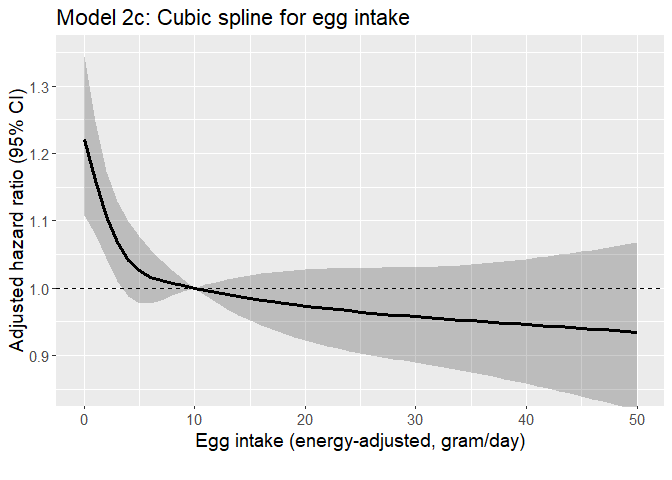

Egg dementia study
================

## Aim

- Association between egg intake and the incidence of Alzheimer’s
  disease in the AHS-2 cohort linked with Medicare data
- This summary focuses on the outcome of Alzheimer’s disease, not
  including other types of dementia

## Datasets

- Medicare data
  - For details regarding Medicare data, see [AHS-2 Medicare
    Linkage](https://github.com/keijioda/ahs_medicare_linkage/blob/main/summary.md)
    repository.

  - Master Beneficiary Summary File (MBSF), 2008-2020

    - Contains beneficiary characteristics and enrollment information

  - Chronic Conditions file (CC), 2008-2020

    - Contains the first occurrence date of 27 specific chronic
      conditions
    - Used to identify prevalent/incident cases of dementia and/or
      Alzheimer’s disease and
    - to identify comorbidities

  - Both files include n = 44,585 unique subjects across years, after
    excluding

    - Gender/DOB mismatch with AHS-2 data
    - Dupulicate beneficiary IDs and SSNs
- For AHS-2 baseline data, including food-frequency questionnaire (FFQ),
  a guided multiple imputation was used to fill missing data ([Fraser &
  Yan, 2007](https://pubmed.ncbi.nlm.nih.gov/17259903/))
  - Five imputed data sets were generated for subsequent analyses (See
    the analysis section for more details)
  - For descriptive analysis, we present results from the first imputed
    data
- AHS-2 baseline imputed data \#1: n = 41,041
  - ~~Among this, n = 383 subjects were excluded because they opted out
    of the study~~
  - ~~After removing opt-outs, there were n = 87,668 subjects~~
  - Opt-outs were already excluded
- After merging Medicare and AHS-2 data, there were n = 41,099 subjects.

## Inclusion/exclusion criteria

- Medicare beneficiaries who did not reach the age of 65 between 2008
  and 2020 (e.g., younger beneficiaries with disabilities or end-stage
  renal disease) were excluded, resulting n = 39,709.

- Subjects with extreme BMI (\<16 or \>60), according to AHS
  questionnaire, were excluded, resulting n = 39,626.

- Prevalent cases of Alzheimer’s disease

  - If the first diagnosis was made before AHS-2 enrollment or within 6
    months after the enrollment, consider it as a prevalent case
  - n = 109 such prevalent cases were excluded, resulting n = 39,517
    subjects

- Unverified dates of deaths

  - Medicare data include a variable (`VALID_DEATH_DT_SW`) indicating
    whether a beneficiary’s day of death has been verified by the Social
    Security Administration or the Railroad Retirement Board.
  - There were 19 unverified death dates. Excluding these resulted n =
    39,498.

## Dietary variables

- Gram intakes of 3 food groups (meat, fish, and dairy) were calculated
  (gram/day) according to AHS-2 food frequency questionnaire.

- For each food group, its dietary intake was energy-adjusted by the
  residual method, while partitioning zero intake ([Jaceldo-Siegl et
  al., 2011](https://www.ncbi.nlm.nih.gov/pmc/articles/PMC3433053/)).
  Due to its highly right-skewed distribution, non-zero intake was
  log-transformed before being regressed on the total energy intake.
  Residuals were added by the mean of log and then back-transformed to
  obtain energy-adjusted dietary intake. Energy-adjusted dietary intake
  was added with (unadjusted) supplement intake to form energy-adjuste
  total intake.

- Subjects were then divided into 4 intake levels.

  - For meat and fish, about 50% of subjects indicated zero intake and
    they were classified to a non-consumption group. The rest of the
    subjects were approximately equally allocated to 3 consumption
    groups according to their intake.
  - Similarly for dairy, about 11% of subjects reported zero
    consumption.
  - For other food group variables, subjects were divided into
    approximately 4 quartile groups.
  - For cut-off values of the four food groups, please see the
    descriptive table below.

- Mean and 25th, 50th, 75th percentiles of gram intake by intake group
  are shown below:

| meat_gram_ea_4 |     n |   pct |  mean |    p1 |    p2 |    p3 |
|:---------------|------:|------:|------:|------:|------:|------:|
| None           | 19831 | 50.21 |  0.00 |  0.00 |  0.00 |  0.00 |
| \<11 g/d       |  6626 | 16.78 |  5.78 |  3.92 |  5.73 |  7.64 |
| 11-\<32 g/d    |  6482 | 16.41 | 19.37 | 14.30 | 18.40 | 23.76 |
| 32+ g/d        |  6559 | 16.61 | 62.68 | 41.37 | 54.45 | 74.94 |

| fish_gram_ea_4 |     n |   pct |  mean |    p1 |    p2 |    p3 |
|:---------------|------:|------:|------:|------:|------:|------:|
| None           | 19356 | 49.01 |  0.00 |  0.00 |  0.00 |  0.00 |
| \<9 g/d        |  7122 | 18.03 |  5.40 |  3.55 |  5.53 |  7.18 |
| 9-\<18 g/d     |  6766 | 17.13 | 13.05 | 10.84 | 12.85 | 15.11 |
| 18+ g/d        |  6254 | 15.83 | 36.53 | 21.72 | 28.09 | 43.01 |

| alldairy2_gram_ea_4 |     n |   pct |   mean |     p1 |     p2 |     p3 |
|:--------------------|------:|------:|-------:|-------:|-------:|-------:|
| None                |  4501 | 11.40 |   0.00 |   0.00 |   0.00 |   0.00 |
| \<50 g/d            | 11404 | 28.87 |  21.68 |   9.73 |  20.14 |  33.01 |
| 50-\<180 g/d        | 11690 | 29.60 | 106.59 |  72.79 | 103.22 | 138.11 |
| 180+ g/d            | 11903 | 30.14 | 370.82 | 234.64 | 307.57 | 428.37 |

| nutsseeds_gram_ea_4 |     n |   pct |  mean |    p1 |    p2 |    p3 |
|:--------------------|------:|------:|------:|------:|------:|------:|
| \<9 g/d             |  9917 | 25.11 |  4.74 |  2.63 |  4.95 |  6.99 |
| 9-\<19 g/d          | 10329 | 26.15 | 13.75 | 11.26 | 13.56 | 16.20 |
| 19-\<33 g/d         |  9789 | 24.78 | 25.35 | 21.95 | 25.01 | 28.60 |
| 33+ g/d             |  9463 | 23.96 | 51.75 | 38.11 | 45.57 | 58.02 |

| totalveg_gram_ea_4 |     n |   pct |   mean |     p1 |     p2 |     p3 |
|:-------------------|------:|------:|-------:|-------:|-------:|-------:|
| \<185 g/d          | 10054 | 25.45 | 127.76 | 100.21 | 134.91 | 161.90 |
| 185-\<270 g/d      |  9753 | 24.69 | 227.11 | 206.05 | 226.73 | 248.22 |
| 270-\<380 g/d      |  9939 | 25.16 | 320.77 | 293.63 | 318.76 | 346.70 |
| 380+ g/d           |  9752 | 24.69 | 535.45 | 422.73 | 481.22 | 582.79 |

| fruits_gram_ea_4 |    n |   pct |   mean |     p1 |     p2 |     p3 |
|:-----------------|-----:|------:|-------:|-------:|-------:|-------:|
| \<170 g/d        | 9909 | 25.09 | 102.28 |  69.28 | 107.50 | 140.16 |
| 170-\<280 g/d    | 9811 | 24.84 | 225.17 | 198.11 | 224.70 | 252.10 |
| 280-\<420 g/d    | 9931 | 25.14 | 344.82 | 309.54 | 342.04 | 378.70 |
| 420+ g/d         | 9847 | 24.93 | 616.51 | 472.44 | 547.08 | 684.02 |

| legumes_gram_ea_4 |     n |   pct |   mean |     p1 |     p2 |     p3 |
|:------------------|------:|------:|-------:|-------:|-------:|-------:|
| \<33 g/d          |  9699 | 24.56 |  16.62 |   8.54 |  17.41 |  25.48 |
| 33-\<60 g/d       |  9671 | 24.48 |  46.61 |  39.91 |  46.77 |  53.30 |
| 60-\<100 g/d      | 10386 | 26.30 |  77.60 |  67.76 |  76.55 |  86.71 |
| 100+ g/d          |  9742 | 24.66 | 168.11 | 116.70 | 142.95 | 192.69 |

| refgrains_gram_ea_4 |     n |   pct |   mean |     p1 |     p2 |     p3 |
|:--------------------|------:|------:|-------:|-------:|-------:|-------:|
| \<40 g/d            | 10362 | 26.23 |  21.21 |  13.04 |  21.84 |  30.63 |
| 40-\<83 g/d         |  9981 | 25.27 |  60.28 |  49.69 |  59.57 |  70.72 |
| 83-\<150 g/d        |  9771 | 24.74 | 112.72 |  95.97 | 111.08 | 128.25 |
| 150+ g/d            |  9384 | 23.76 | 271.55 | 178.10 | 224.23 | 312.06 |

| whole_mixed_grains_gram_ea_4 |     n |   pct |   mean |     p1 |     p2 |     p3 |
|:-----------------------------|------:|------:|-------:|-------:|-------:|-------:|
| \<120 g/d                    | 10209 | 25.85 |  71.29 |  48.63 |  75.15 |  98.38 |
| 120-\<210 g/d                |  9621 | 24.36 | 162.75 | 140.44 | 161.63 | 184.07 |
| 210-\<350 g/d                |  9681 | 24.51 | 273.49 | 238.02 | 270.46 | 307.12 |
| 350+ g/d                     |  9987 | 25.28 | 519.62 | 402.71 | 474.13 | 591.23 |

- For egg intake and meat intake, a crosstab was produced:
  - The first table was stratified by meat intake (% of egg intake
    within each meat level)
  - The second table was stratified by egg intake (% of meat intake
    within each egg level)

|  | level | None | \<11 g/d | 11-\<32 g/d | 32+ g/d | p | test |
|:---|:---|:---|:---|:---|:---|:---|:---|
| n |  | 19831 | 6626 | 6482 | 6559 |  |  |
| egg_freq (%) | Never | 8552 (43.1) | 1003 (15.1) | 599 ( 9.2) | 482 ( 7.3) | \<0.001 |  |
|  | 1-3/mo | 4841 (24.4) | 2091 (31.6) | 1856 (28.6) | 1395 (21.3) |  |  |
|  | 1/wk | 2792 (14.1) | 1397 (21.1) | 1411 (21.8) | 1338 (20.4) |  |  |
|  | 2-4/wk | 3122 (15.7) | 1770 (26.7) | 2115 (32.6) | 2486 (37.9) |  |  |
|  | 5+/wk | 524 ( 2.6) | 365 ( 5.5) | 501 ( 7.7) | 858 (13.1) |  |  |

|  | level | Never | 1-3/mo | 1/wk | 2-4/wk | 5+/wk | p | test |
|:---|:---|:---|:---|:---|:---|:---|:---|:---|
| n |  | 10636 | 10183 | 6938 | 9493 | 2248 |  |  |
| meat_gram_ea_4 (%) | None | 8552 (80.4) | 4841 (47.5) | 2792 (40.2) | 3122 (32.9) | 524 (23.3) | \<0.001 |  |
|  | \<11 g/d | 1003 ( 9.4) | 2091 (20.5) | 1397 (20.1) | 1770 (18.6) | 365 (16.2) |  |  |
|  | 11-\<32 g/d | 599 ( 5.6) | 1856 (18.2) | 1411 (20.3) | 2115 (22.3) | 501 (22.3) |  |  |
|  | 32+ g/d | 482 ( 4.5) | 1395 (13.7) | 1338 (19.3) | 2486 (26.2) | 858 (38.2) |  |  |

## Descriptive table

- The descriptive table by case/non-case:
  - Age, gender, and race (RTI race code, recoded into
    White/Black/Other) were derived from Medicare MBSF data.
    - Age was calculated at the end of year 2020 (for the sake of
      comparison; some of the subjects may have died by then)
  - Other demographic and lifestyle variables were derived from AHS-2
    baseline questionnaire
    - Marital status (married, never married, widowed/divorced)
    - Education level (high school or less, some college, college
      graduate)
    - Dietary pattern (5 levels: vegan, lacto-ovo, semi, pesco and
      non-vegetarians)
    - BMI group
    - Exercise (none, ≤0.5 hrs/wk, 0.5\<-2 hrs/wk, \>2 hrs/wk)
    - Smoking (6 categories)
    - Current alcohol use (none/current)
    - Sleep hours
  - Comorbidity variables (yes/no) were derived from Medicare chronic
    condition data. Those who were diagnosed with the following
    conditions prior to study enrollment were flagged.
    - Cancer: breast, colorectal, lung, prostate, endometrial
    - CVD: Acute MI, atrial fibrillation, congestive heart failure,
      ischemic heart disease, stroke/TIA
    - Hypertension
    - hyperlipidemia
    - Respiratory diseases: COPD, asthma
    - Anemia
    - Diabetes
    - Chronic kidney diseases
    - Hypothyroidism
    - Depression
    - Functional disabilities: Cataract, glaucoma, hip/pelvic fracture,
      osteoporosis, rheumatoid arthritis/osteoarthritis
- For those diagnosed with dementia/AD, the mean age at diagnosis was
  83.3 years (median 84.0 years)

|  | level | Overall | Non-case | Case | p | test |
|:---|:---|:---|:---|:---|:---|:---|
| n |  | 39498 | 36640 | 2858 |  |  |
| agecat (%) | 65-69 | 6686 (16.9) | 6664 (18.2) | 22 ( 0.8) | \<0.001 |  |
|  | 70-74 | 6941 (17.6) | 6869 (18.7) | 72 ( 2.5) |  |  |
|  | 75-79 | 6294 (15.9) | 6108 (16.7) | 186 ( 6.5) |  |  |
|  | 80-84 | 5624 (14.2) | 5264 (14.4) | 360 (12.6) |  |  |
|  | 85-89 | 5037 (12.8) | 4467 (12.2) | 570 (19.9) |  |  |
|  | 90-94 | 4282 (10.8) | 3549 ( 9.7) | 733 (25.6) |  |  |
|  | 95+ | 4634 (11.7) | 3719 (10.2) | 915 (32.0) |  |  |
| bene_age_at_end_2020 (mean (SD)) |  | 81.14 (10.48) | 80.37 (10.25) | 91.04 (8.10) | \<0.001 |  |
| age_medicare_cat (%) | \<50 | 632 ( 1.6) | 597 ( 1.6) | 35 ( 1.2) | \<0.001 |  |
|  | 50-54 | 485 ( 1.2) | 448 ( 1.2) | 37 ( 1.3) |  |  |
|  | 55-59 | 930 ( 2.4) | 867 ( 2.4) | 63 ( 2.2) |  |  |
|  | 60-63 | 947 ( 2.4) | 874 ( 2.4) | 73 ( 2.6) |  |  |
|  | 64 | 33560 (85.0) | 31099 (84.9) | 2461 (86.1) |  |  |
|  | 65 | 1682 ( 4.3) | 1596 ( 4.4) | 86 ( 3.0) |  |  |
|  | 66-69 | 1062 ( 2.7) | 986 ( 2.7) | 76 ( 2.7) |  |  |
|  | 70+ | 200 ( 0.5) | 173 ( 0.5) | 27 ( 0.9) |  |  |
| age_medicare_cont (mean (SD)) |  | 64.33 (3.55) | 64.32 (3.56) | 64.45 (3.37) | 0.070 |  |
| bene_sex_F (%) | M | 14327 (36.3) | 13385 (36.5) | 942 (33.0) | \<0.001 |  |
|  | F | 25171 (63.7) | 23255 (63.5) | 1916 (67.0) |  |  |
| rti_race3 (%) | NH White | 29352 (74.3) | 27022 (73.8) | 2330 (81.5) | \<0.001 |  |
|  | Black | 7488 (19.0) | 7053 (19.2) | 435 (15.2) |  |  |
|  | Other | 2658 ( 6.7) | 2565 ( 7.0) | 93 ( 3.3) |  |  |
| marital (%) | Married | 28910 (73.2) | 27052 (73.8) | 1858 (65.0) | \<0.001 |  |
|  | Never | 1341 ( 3.4) | 1255 ( 3.4) | 86 ( 3.0) |  |  |
|  | Div/Wid | 9247 (23.4) | 8333 (22.7) | 914 (32.0) |  |  |
| educyou (%) | HSch & below | 8509 (21.5) | 7694 (21.0) | 815 (28.5) | \<0.001 |  |
|  | Some College | 15589 (39.5) | 14500 (39.6) | 1089 (38.1) |  |  |
|  | Bachelors + | 15400 (39.0) | 14446 (39.4) | 954 (33.4) |  |  |
| vegstat (%) | Vegan | 3263 ( 8.3) | 2989 ( 8.2) | 274 ( 9.6) | \<0.001 |  |
|  | Lacto-ovo | 12792 (32.4) | 11762 (32.1) | 1030 (36.0) |  |  |
|  | Semi | 2215 ( 5.6) | 2055 ( 5.6) | 160 ( 5.6) |  |  |
|  | Pesco | 3784 ( 9.6) | 3512 ( 9.6) | 272 ( 9.5) |  |  |
|  | Non-veg | 17444 (44.2) | 16322 (44.5) | 1122 (39.3) |  |  |
| bmicat (%) | Normal | 15280 (38.7) | 14000 (38.2) | 1280 (44.8) | \<0.001 |  |
|  | Overweight | 14365 (36.4) | 13335 (36.4) | 1030 (36.0) |  |  |
|  | Obese | 9853 (24.9) | 9305 (25.4) | 548 (19.2) |  |  |
| bmi (mean (SD)) |  | 27.21 (5.46) | 27.27 (5.48) | 26.41 (5.18) | \<0.001 |  |
| exercise (%) | None | 8828 (22.4) | 7974 (21.8) | 854 (29.9) | \<0.001 |  |
|  | ≤0.5 hrs/wk | 9553 (24.2) | 9015 (24.6) | 538 (18.8) |  |  |
|  | 0.5\<-2 hrs/wk | 10404 (26.3) | 9717 (26.5) | 687 (24.0) |  |  |
|  | \>2 hrs/wk | 10713 (27.1) | 9934 (27.1) | 779 (27.3) |  |  |
| sleephrs (%) | \<= 5 hrs | 3859 ( 9.8) | 3611 ( 9.9) | 248 ( 8.7) | \<0.001 |  |
|  | 6 hrs | 8611 (21.8) | 8040 (21.9) | 571 (20.0) |  |  |
|  | 7 hrs | 14290 (36.2) | 13361 (36.5) | 929 (32.5) |  |  |
|  | 8 hrs | 10486 (26.5) | 9604 (26.2) | 882 (30.9) |  |  |
|  | \>= 9 hrs | 2252 ( 5.7) | 2024 ( 5.5) | 228 ( 8.0) |  |  |
| smokecat6 (%) | A_Never | 31456 (79.6) | 29141 (79.5) | 2315 (81.0) | \<0.001 |  |
|  | B_QuitYrs30Plus | 3419 ( 8.7) | 3088 ( 8.4) | 331 (11.6) |  |  |
|  | C_QuitYrs21To30 | 2023 ( 5.1) | 1925 ( 5.3) | 98 ( 3.4) |  |  |
|  | D_QuitYrs11To20 | 1350 ( 3.4) | 1287 ( 3.5) | 63 ( 2.2) |  |  |
|  | E_QuitYrs6To10 | 482 ( 1.2) | 462 ( 1.3) | 20 ( 0.7) |  |  |
|  | F_QuitYrsLesOneTo5YearsNcur | 768 ( 1.9) | 737 ( 2.0) | 31 ( 1.1) |  |  |
| alccat (%) | None | 37582 (95.1) | 34804 (95.0) | 2778 (97.2) | \<0.001 |  |
|  | Current | 1916 ( 4.9) | 1836 ( 5.0) | 80 ( 2.8) |  |  |
| como_depress (%) | No | 37936 (96.0) | 35403 (96.6) | 2533 (88.6) | \<0.001 |  |
|  | Yes | 1562 ( 4.0) | 1237 ( 3.4) | 325 (11.4) |  |  |
| como_disab (%) | No | 29755 (75.3) | 28624 (78.1) | 1131 (39.6) | \<0.001 |  |
|  | Yes | 9743 (24.7) | 8016 (21.9) | 1727 (60.4) |  |  |
| como_diabetes (%) | No | 37131 (94.0) | 34655 (94.6) | 2476 (86.6) | \<0.001 |  |
|  | Yes | 2367 ( 6.0) | 1985 ( 5.4) | 382 (13.4) |  |  |
| como_cvd (%) | No | 34458 (87.2) | 32488 (88.7) | 1970 (68.9) | \<0.001 |  |
|  | Yes | 5040 (12.8) | 4152 (11.3) | 888 (31.1) |  |  |
| como_hypert (%) | No | 32551 (82.4) | 30856 (84.2) | 1695 (59.3) | \<0.001 |  |
|  | Yes | 6947 (17.6) | 5784 (15.8) | 1163 (40.7) |  |  |
| como_hyperl (%) | No | 33282 (84.3) | 31438 (85.8) | 1844 (64.5) | \<0.001 |  |
|  | Yes | 6216 (15.7) | 5202 (14.2) | 1014 (35.5) |  |  |
| como_resp (%) | No | 37860 (95.9) | 35266 (96.2) | 2594 (90.8) | \<0.001 |  |
|  | Yes | 1638 ( 4.1) | 1374 ( 3.8) | 264 ( 9.2) |  |  |
| como_anemia (%) | No | 35746 (90.5) | 33596 (91.7) | 2150 (75.2) | \<0.001 |  |
|  | Yes | 3752 ( 9.5) | 3044 ( 8.3) | 708 (24.8) |  |  |
| como_kidney (%) | No | 38983 (98.7) | 36200 (98.8) | 2783 (97.4) | \<0.001 |  |
|  | Yes | 515 ( 1.3) | 440 ( 1.2) | 75 ( 2.6) |  |  |
| como_hypoth (%) | No | 36929 (93.5) | 34557 (94.3) | 2372 (83.0) | \<0.001 |  |
|  | Yes | 2569 ( 6.5) | 2083 ( 5.7) | 486 (17.0) |  |  |
| como_cancers (%) | No | 38105 (96.5) | 35463 (96.8) | 2642 (92.4) | \<0.001 |  |
|  | Yes | 1393 ( 3.5) | 1177 ( 3.2) | 216 ( 7.6) |  |  |
| egg_freq (%) | Never | 10636 (26.9) | 9724 (26.5) | 912 (31.9) | \<0.001 |  |
|  | 1-3/mo | 10183 (25.8) | 9500 (25.9) | 683 (23.9) |  |  |
|  | 1/wk | 6938 (17.6) | 6466 (17.6) | 472 (16.5) |  |  |
|  | 2-4/wk | 9493 (24.0) | 8833 (24.1) | 660 (23.1) |  |  |
|  | 5+/wk | 2248 ( 5.7) | 2117 ( 5.8) | 131 ( 4.6) |  |  |
| meat_gram_ea_4 (%) | None | 19831 (50.2) | 18255 (49.8) | 1576 (55.1) | \<0.001 |  |
|  | \<11 g/d | 6626 (16.8) | 6119 (16.7) | 507 (17.7) |  |  |
|  | 11-\<32 g/d | 6482 (16.4) | 6061 (16.5) | 421 (14.7) |  |  |
|  | 32+ g/d | 6559 (16.6) | 6205 (16.9) | 354 (12.4) |  |  |
| meat_gram_ea (mean (SD)) |  | 14.56 (25.91) | 14.85 (26.22) | 10.86 (21.23) | \<0.001 |  |
| fish_gram_ea_4 (%) | None | 19356 (49.0) | 17826 (48.7) | 1530 (53.5) | \<0.001 |  |
|  | \<9 g/d | 7122 (18.0) | 6566 (17.9) | 556 (19.5) |  |  |
|  | 9-\<18 g/d | 6766 (17.1) | 6329 (17.3) | 437 (15.3) |  |  |
|  | 18+ g/d | 6254 (15.8) | 5919 (16.2) | 335 (11.7) |  |  |
| fish_gram_ea (mean (SD)) |  | 8.99 (15.89) | 9.12 (16.03) | 7.33 (14.00) | \<0.001 |  |
| alldairy2_gram_ea_4 (%) | None | 4501 (11.4) | 4141 (11.3) | 360 (12.6) | 0.025 |  |
|  | \<50 g/d | 11404 (28.9) | 10590 (28.9) | 814 (28.5) |  |  |
|  | 50-\<180 g/d | 11690 (29.6) | 10900 (29.7) | 790 (27.6) |  |  |
|  | 180+ g/d | 11903 (30.1) | 11009 (30.0) | 894 (31.3) |  |  |
| alldairy2_gram_ea (mean (SD)) |  | 149.56 (187.10) | 149.31 (186.80) | 152.72 (190.86) | 0.349 |  |
| totalveg_gram_ea_4 (%) | \<185 g/d | 10054 (25.5) | 9352 (25.5) | 702 (24.6) | 0.562 |  |
|  | 185-\<270 g/d | 9753 (24.7) | 9028 (24.6) | 725 (25.4) |  |  |
|  | 270-\<380 g/d | 9939 (25.2) | 9204 (25.1) | 735 (25.7) |  |  |
|  | 380+ g/d | 9752 (24.7) | 9056 (24.7) | 696 (24.4) |  |  |
| totalveg_gram_ea (mean (SD)) |  | 301.52 (177.69) | 301.49 (178.37) | 301.89 (168.69) | 0.906 |  |
| fruits_gram_ea_4 (%) | \<170 g/d | 9909 (25.1) | 9333 (25.5) | 576 (20.2) | \<0.001 |  |
|  | 170-\<280 g/d | 9811 (24.8) | 9152 (25.0) | 659 (23.1) |  |  |
|  | 280-\<420 g/d | 9931 (25.1) | 9111 (24.9) | 820 (28.7) |  |  |
|  | 420+ g/d | 9847 (24.9) | 9044 (24.7) | 803 (28.1) |  |  |
| fruits_gram_ea (mean (SD)) |  | 321.99 (220.95) | 320.16 (220.97) | 345.47 (219.49) | \<0.001 |  |
| refgrains_gram_ea_4 (%) | \<40 g/d | 10362 (26.2) | 9405 (25.7) | 957 (33.5) | \<0.001 |  |
|  | 40-\<83 g/d | 9981 (25.3) | 9252 (25.3) | 729 (25.5) |  |  |
|  | 83-\<150 g/d | 9771 (24.7) | 9152 (25.0) | 619 (21.7) |  |  |
|  | 150+ g/d | 9384 (23.8) | 8831 (24.1) | 553 (19.3) |  |  |
| refgrains_gram_ea (mean (SD)) |  | 113.19 (116.30) | 114.30 (116.71) | 99.08 (109.96) | \<0.001 |  |
| whole_mixed_grains_gram_ea_4 (%) | \<120 g/d | 10209 (25.8) | 9605 (26.2) | 604 (21.1) | \<0.001 |  |
|  | 120-\<210 g/d | 9621 (24.4) | 8943 (24.4) | 678 (23.7) |  |  |
|  | 210-\<350 g/d | 9681 (24.5) | 8920 (24.3) | 761 (26.6) |  |  |
|  | 350+ g/d | 9987 (25.3) | 9172 (25.0) | 815 (28.5) |  |  |
| whole_mixed_grains_gram_ea (mean (SD)) |  | 256.49 (188.51) | 255.02 (188.19) | 275.34 (191.60) | \<0.001 |  |
| nutsseeds_gram_ea_4 (%) | \<9 g/d | 9917 (25.1) | 9290 (25.4) | 627 (21.9) | \<0.001 |  |
|  | 9-\<19 g/d | 10329 (26.2) | 9636 (26.3) | 693 (24.2) |  |  |
|  | 19-\<33 g/d | 9789 (24.8) | 9068 (24.7) | 721 (25.2) |  |  |
|  | 33+ g/d | 9463 (24.0) | 8646 (23.6) | 817 (28.6) |  |  |
| nutsseeds_gram_ea (mean (SD)) |  | 23.47 (20.30) | 23.26 (20.11) | 26.09 (22.35) | \<0.001 |  |
| legumes_gram_ea_4 (%) | \<33 g/d | 9699 (24.6) | 8990 (24.5) | 709 (24.8) | 0.005 |  |
|  | 33-\<60 g/d | 9671 (24.5) | 8903 (24.3) | 768 (26.9) |  |  |
|  | 60-\<100 g/d | 10386 (26.3) | 9651 (26.3) | 735 (25.7) |  |  |
|  | 100+ g/d | 9742 (24.7) | 9096 (24.8) | 646 (22.6) |  |  |
| legumes_gram_ea (mean (SD)) |  | 77.36 (69.18) | 77.67 (69.62) | 73.44 (63.15) | 0.002 |  |

## Descriptive table by egg intake

|  | level | Overall | Never | 1-3/mo | 1/wk | 2-4/wk | 5+/wk | p | test |
|:---|:---|:---|:---|:---|:---|:---|:---|:---|:---|
| n |  | 39498 | 10636 | 10183 | 6938 | 9493 | 2248 |  |  |
| ALZH_YN2 (%) | Non-case | 36640 (92.8) | 9724 (91.4) | 9500 (93.3) | 6466 (93.2) | 8833 (93.0) | 2117 (94.2) | \<0.001 |  |
|  | Case | 2858 ( 7.2) | 912 ( 8.6) | 683 ( 6.7) | 472 ( 6.8) | 660 ( 7.0) | 131 ( 5.8) |  |  |
| agecat (%) | 65-69 | 6686 (16.9) | 1643 (15.4) | 1819 (17.9) | 1201 (17.3) | 1628 (17.1) | 395 (17.6) | \<0.001 |  |
|  | 70-74 | 6941 (17.6) | 1795 (16.9) | 1836 (18.0) | 1252 (18.0) | 1660 (17.5) | 398 (17.7) |  |  |
|  | 75-79 | 6294 (15.9) | 1669 (15.7) | 1671 (16.4) | 1092 (15.7) | 1465 (15.4) | 397 (17.7) |  |  |
|  | 80-84 | 5624 (14.2) | 1532 (14.4) | 1414 (13.9) | 958 (13.8) | 1389 (14.6) | 331 (14.7) |  |  |
|  | 85-89 | 5037 (12.8) | 1386 (13.0) | 1268 (12.5) | 913 (13.2) | 1194 (12.6) | 276 (12.3) |  |  |
|  | 90-94 | 4282 (10.8) | 1239 (11.6) | 1046 (10.3) | 727 (10.5) | 1034 (10.9) | 236 (10.5) |  |  |
|  | 95+ | 4634 (11.7) | 1372 (12.9) | 1129 (11.1) | 795 (11.5) | 1123 (11.8) | 215 ( 9.6) |  |  |
| bene_age_at_end_2020 (mean (SD)) |  | 81.14 (10.48) | 81.76 (10.59) | 80.73 (10.40) | 80.97 (10.45) | 81.16 (10.52) | 80.47 (10.09) | \<0.001 |  |
| bene_sex_F (%) | M | 14327 (36.3) | 3773 (35.5) | 3372 (33.1) | 2740 (39.5) | 3503 (36.9) | 939 (41.8) | \<0.001 |  |
|  | F | 25171 (63.7) | 6863 (64.5) | 6811 (66.9) | 4198 (60.5) | 5990 (63.1) | 1309 (58.2) |  |  |
| rti_race3 (%) | NH White | 29352 (74.3) | 7785 (73.2) | 7211 (70.8) | 5319 (76.7) | 7228 (76.1) | 1809 (80.5) | \<0.001 |  |
|  | Black | 7488 (19.0) | 2200 (20.7) | 2253 (22.1) | 1092 (15.7) | 1622 (17.1) | 321 (14.3) |  |  |
|  | Other | 2658 ( 6.7) | 651 ( 6.1) | 719 ( 7.1) | 527 ( 7.6) | 643 ( 6.8) | 118 ( 5.2) |  |  |
| marital (%) | Married | 28910 (73.2) | 7726 (72.6) | 7204 (70.7) | 5350 (77.1) | 7011 (73.9) | 1619 (72.0) | \<0.001 |  |
|  | Never | 1341 ( 3.4) | 420 ( 3.9) | 383 ( 3.8) | 176 ( 2.5) | 297 ( 3.1) | 65 ( 2.9) |  |  |
|  | Div/Wid | 9247 (23.4) | 2490 (23.4) | 2596 (25.5) | 1412 (20.4) | 2185 (23.0) | 564 (25.1) |  |  |
| educyou (%) | HSch & below | 8509 (21.5) | 2142 (20.1) | 2328 (22.9) | 1396 (20.1) | 2090 (22.0) | 553 (24.6) | \<0.001 |  |
|  | Some College | 15589 (39.5) | 4055 (38.1) | 3981 (39.1) | 2684 (38.7) | 3898 (41.1) | 971 (43.2) |  |  |
|  | Bachelors + | 15400 (39.0) | 4439 (41.7) | 3874 (38.0) | 2858 (41.2) | 3505 (36.9) | 724 (32.2) |  |  |
| vegstat (%) | Vegan | 3263 ( 8.3) | 3263 (30.7) | 0 ( 0.0) | 0 ( 0.0) | 0 ( 0.0) | 0 ( 0.0) | \<0.001 |  |
|  | Lacto-ovo | 12792 (32.4) | 4220 (39.7) | 3771 (37.0) | 2135 (30.8) | 2286 (24.1) | 380 (16.9) |  |  |
|  | Semi | 2215 ( 5.6) | 377 ( 3.5) | 755 ( 7.4) | 462 ( 6.7) | 533 ( 5.6) | 88 ( 3.9) |  |  |
|  | Pesco | 3784 ( 9.6) | 1072 (10.1) | 1072 (10.5) | 657 ( 9.5) | 838 ( 8.8) | 145 ( 6.5) |  |  |
|  | Non-veg | 17444 (44.2) | 1704 (16.0) | 4585 (45.0) | 3684 (53.1) | 5836 (61.5) | 1635 (72.7) |  |  |
| bmicat (%) | Normal | 15280 (38.7) | 5593 (52.6) | 3845 (37.8) | 2492 (35.9) | 2824 (29.7) | 526 (23.4) | \<0.001 |  |
|  | Overweight | 14365 (36.4) | 3343 (31.4) | 3863 (37.9) | 2698 (38.9) | 3664 (38.6) | 797 (35.5) |  |  |
|  | Obese | 9853 (24.9) | 1700 (16.0) | 2475 (24.3) | 1748 (25.2) | 3005 (31.7) | 925 (41.1) |  |  |
| bmi (mean (SD)) |  | 27.21 (5.46) | 25.58 (4.95) | 27.25 (5.36) | 27.41 (5.29) | 28.32 (5.61) | 29.42 (5.97) | \<0.001 |  |
| exercise (%) | None | 8828 (22.4) | 2117 (19.9) | 2344 (23.0) | 1475 (21.3) | 2262 (23.8) | 630 (28.0) | \<0.001 |  |
|  | ≤0.5 hrs/wk | 9553 (24.2) | 2196 (20.6) | 2489 (24.4) | 1826 (26.3) | 2483 (26.2) | 559 (24.9) |  |  |
|  | 0.5\<-2 hrs/wk | 10404 (26.3) | 2863 (26.9) | 2629 (25.8) | 1866 (26.9) | 2519 (26.5) | 527 (23.4) |  |  |
|  | \>2 hrs/wk | 10713 (27.1) | 3460 (32.5) | 2721 (26.7) | 1771 (25.5) | 2229 (23.5) | 532 (23.7) |  |  |
| sleephrs (%) | \<= 5 hrs | 3859 ( 9.8) | 982 ( 9.2) | 1077 (10.6) | 620 ( 8.9) | 938 ( 9.9) | 242 (10.8) | \<0.001 |  |
|  | 6 hrs | 8611 (21.8) | 2228 (20.9) | 2374 (23.3) | 1468 (21.2) | 2041 (21.5) | 500 (22.2) |  |  |
|  | 7 hrs | 14290 (36.2) | 3890 (36.6) | 3582 (35.2) | 2608 (37.6) | 3456 (36.4) | 754 (33.5) |  |  |
|  | 8 hrs | 10486 (26.5) | 2951 (27.7) | 2581 (25.3) | 1860 (26.8) | 2496 (26.3) | 598 (26.6) |  |  |
|  | \>= 9 hrs | 2252 ( 5.7) | 585 ( 5.5) | 569 ( 5.6) | 382 ( 5.5) | 562 ( 5.9) | 154 ( 6.9) |  |  |
| smokecat6 (%) | A_Never | 31456 (79.6) | 8766 (82.4) | 8166 (80.2) | 5597 (80.7) | 7319 (77.1) | 1608 (71.5) | \<0.001 |  |
|  | B_QuitYrs30Plus | 3419 ( 8.7) | 894 ( 8.4) | 829 ( 8.1) | 558 ( 8.0) | 900 ( 9.5) | 238 (10.6) |  |  |
|  | C_QuitYrs21To30 | 2023 ( 5.1) | 502 ( 4.7) | 497 ( 4.9) | 349 ( 5.0) | 519 ( 5.5) | 156 ( 6.9) |  |  |
|  | D_QuitYrs11To20 | 1350 ( 3.4) | 270 ( 2.5) | 362 ( 3.6) | 224 ( 3.2) | 384 ( 4.0) | 110 ( 4.9) |  |  |
|  | E_QuitYrs6To10 | 482 ( 1.2) | 96 ( 0.9) | 120 ( 1.2) | 85 ( 1.2) | 132 ( 1.4) | 49 ( 2.2) |  |  |
|  | F_QuitYrsLesOneTo5YearsNcur | 768 ( 1.9) | 108 ( 1.0) | 209 ( 2.1) | 125 ( 1.8) | 239 ( 2.5) | 87 ( 3.9) |  |  |
| alccat (%) | None | 37582 (95.1) | 10426 (98.0) | 9721 (95.5) | 6531 (94.1) | 8880 (93.5) | 2024 (90.0) | \<0.001 |  |
|  | Current | 1916 ( 4.9) | 210 ( 2.0) | 462 ( 4.5) | 407 ( 5.9) | 613 ( 6.5) | 224 (10.0) |  |  |
| como_depress (%) | No | 37936 (96.0) | 10235 (96.2) | 9785 (96.1) | 6690 (96.4) | 9081 (95.7) | 2145 (95.4) | 0.046 |  |
|  | Yes | 1562 ( 4.0) | 401 ( 3.8) | 398 ( 3.9) | 248 ( 3.6) | 412 ( 4.3) | 103 ( 4.6) |  |  |
| como_disab (%) | No | 29755 (75.3) | 7852 (73.8) | 7791 (76.5) | 5292 (76.3) | 7117 (75.0) | 1703 (75.8) | \<0.001 |  |
|  | Yes | 9743 (24.7) | 2784 (26.2) | 2392 (23.5) | 1646 (23.7) | 2376 (25.0) | 545 (24.2) |  |  |
| como_diabetes (%) | No | 37131 (94.0) | 10146 (95.4) | 9621 (94.5) | 6510 (93.8) | 8799 (92.7) | 2055 (91.4) | \<0.001 |  |
|  | Yes | 2367 ( 6.0) | 490 ( 4.6) | 562 ( 5.5) | 428 ( 6.2) | 694 ( 7.3) | 193 ( 8.6) |  |  |
| como_cvd (%) | No | 34458 (87.2) | 9272 (87.2) | 8913 (87.5) | 6071 (87.5) | 8253 (86.9) | 1949 (86.7) | 0.626 |  |
|  | Yes | 5040 (12.8) | 1364 (12.8) | 1270 (12.5) | 867 (12.5) | 1240 (13.1) | 299 (13.3) |  |  |
| como_hypert (%) | No | 32551 (82.4) | 8978 (84.4) | 8404 (82.5) | 5725 (82.5) | 7633 (80.4) | 1811 (80.6) | \<0.001 |  |
|  | Yes | 6947 (17.6) | 1658 (15.6) | 1779 (17.5) | 1213 (17.5) | 1860 (19.6) | 437 (19.4) |  |  |
| como_hyperl (%) | No | 33282 (84.3) | 9032 (84.9) | 8582 (84.3) | 5838 (84.1) | 7929 (83.5) | 1901 (84.6) | 0.108 |  |
|  | Yes | 6216 (15.7) | 1604 (15.1) | 1601 (15.7) | 1100 (15.9) | 1564 (16.5) | 347 (15.4) |  |  |
| como_resp (%) | No | 37860 (95.9) | 10248 (96.4) | 9798 (96.2) | 6647 (95.8) | 9037 (95.2) | 2130 (94.8) | \<0.001 |  |
|  | Yes | 1638 ( 4.1) | 388 ( 3.6) | 385 ( 3.8) | 291 ( 4.2) | 456 ( 4.8) | 118 ( 5.2) |  |  |
| como_anemia (%) | No | 35746 (90.5) | 9584 (90.1) | 9257 (90.9) | 6316 (91.0) | 8547 (90.0) | 2042 (90.8) | 0.065 |  |
|  | Yes | 3752 ( 9.5) | 1052 ( 9.9) | 926 ( 9.1) | 622 ( 9.0) | 946 (10.0) | 206 ( 9.2) |  |  |
| como_kidney (%) | No | 38983 (98.7) | 10525 (99.0) | 10058 (98.8) | 6852 (98.8) | 9340 (98.4) | 2208 (98.2) | 0.002 |  |
|  | Yes | 515 ( 1.3) | 111 ( 1.0) | 125 ( 1.2) | 86 ( 1.2) | 153 ( 1.6) | 40 ( 1.8) |  |  |
| como_hypoth (%) | No | 36929 (93.5) | 9959 (93.6) | 9535 (93.6) | 6489 (93.5) | 8838 (93.1) | 2108 (93.8) | 0.492 |  |
|  | Yes | 2569 ( 6.5) | 677 ( 6.4) | 648 ( 6.4) | 449 ( 6.5) | 655 ( 6.9) | 140 ( 6.2) |  |  |
| como_cancers (%) | No | 38105 (96.5) | 10245 (96.3) | 9824 (96.5) | 6725 (96.9) | 9137 (96.2) | 2174 (96.7) | 0.152 |  |
|  | Yes | 1393 ( 3.5) | 391 ( 3.7) | 359 ( 3.5) | 213 ( 3.1) | 356 ( 3.8) | 74 ( 3.3) |  |  |
| meat_gram_ea_4 (%) | None | 19831 (50.2) | 8552 (80.4) | 4841 (47.5) | 2792 (40.2) | 3122 (32.9) | 524 (23.3) | \<0.001 |  |
|  | \<11 g/d | 6626 (16.8) | 1003 ( 9.4) | 2091 (20.5) | 1397 (20.1) | 1770 (18.6) | 365 (16.2) |  |  |
|  | 11-\<32 g/d | 6482 (16.4) | 599 ( 5.6) | 1856 (18.2) | 1411 (20.3) | 2115 (22.3) | 501 (22.3) |  |  |
|  | 32+ g/d | 6559 (16.6) | 482 ( 4.5) | 1395 (13.7) | 1338 (19.3) | 2486 (26.2) | 858 (38.2) |  |  |
| meat_gram_ea (mean (SD)) |  | 14.56 (25.91) | 4.37 (15.12) | 12.78 (22.60) | 16.71 (25.46) | 22.08 (29.85) | 32.42 (39.57) | \<0.001 |  |
| fish_gram_ea_4 (%) | None | 19356 (49.0) | 8018 (75.4) | 4780 (46.9) | 2757 (39.7) | 3197 (33.7) | 604 (26.9) | \<0.001 |  |
|  | \<9 g/d | 7122 (18.0) | 1073 (10.1) | 2014 (19.8) | 1420 (20.5) | 2039 (21.5) | 576 (25.6) |  |  |
|  | 9-\<18 g/d | 6766 (17.1) | 780 ( 7.3) | 1848 (18.1) | 1431 (20.6) | 2170 (22.9) | 537 (23.9) |  |  |
|  | 18+ g/d | 6254 (15.8) | 765 ( 7.2) | 1541 (15.1) | 1330 (19.2) | 2087 (22.0) | 531 (23.6) |  |  |
| fish_gram_ea (mean (SD)) |  | 8.99 (15.89) | 4.42 (12.88) | 8.94 (15.90) | 10.54 (16.28) | 11.99 (16.66) | 13.47 (18.82) | \<0.001 |  |
| alldairy2_gram_ea_4 (%) | None | 4501 (11.4) | 3723 (35.0) | 436 ( 4.3) | 154 ( 2.2) | 150 ( 1.6) | 38 ( 1.7) | \<0.001 |  |
|  | \<50 g/d | 11404 (28.9) | 4119 (38.7) | 3410 (33.5) | 1601 (23.1) | 1860 (19.6) | 414 (18.4) |  |  |
|  | 50-\<180 g/d | 11690 (29.6) | 1645 (15.5) | 3332 (32.7) | 2452 (35.3) | 3459 (36.4) | 802 (35.7) |  |  |
|  | 180+ g/d | 11903 (30.1) | 1149 (10.8) | 3005 (29.5) | 2731 (39.4) | 4024 (42.4) | 994 (44.2) |  |  |
| alldairy2_gram_ea (mean (SD)) |  | 149.56 (187.10) | 63.85 (140.67) | 152.47 (187.87) | 190.84 (196.43) | 199.20 (189.21) | 204.80 (194.52) | \<0.001 |  |
| totalveg_gram_ea_4 (%) | \<185 g/d | 10054 (25.5) | 2091 (19.7) | 2793 (27.4) | 1805 (26.0) | 2606 (27.5) | 759 (33.8) | \<0.001 |  |
|  | 185-\<270 g/d | 9753 (24.7) | 2339 (22.0) | 2496 (24.5) | 1819 (26.2) | 2549 (26.9) | 550 (24.5) |  |  |
|  | 270-\<380 g/d | 9939 (25.2) | 2724 (25.6) | 2520 (24.7) | 1790 (25.8) | 2396 (25.2) | 509 (22.6) |  |  |
|  | 380+ g/d | 9752 (24.7) | 3482 (32.7) | 2374 (23.3) | 1524 (22.0) | 1942 (20.5) | 430 (19.1) |  |  |
| totalveg_gram_ea (mean (SD)) |  | 301.52 (177.69) | 342.20 (208.90) | 293.17 (172.00) | 289.22 (154.10) | 281.84 (156.06) | 267.90 (163.71) | \<0.001 |  |
| fruits_gram_ea_4 (%) | \<170 g/d | 9909 (25.1) | 1566 (14.7) | 2538 (24.9) | 1821 (26.2) | 3008 (31.7) | 976 (43.4) | \<0.001 |  |
|  | 170-\<280 g/d | 9811 (24.8) | 2106 (19.8) | 2466 (24.2) | 1872 (27.0) | 2785 (29.3) | 582 (25.9) |  |  |
|  | 280-\<420 g/d | 9931 (25.1) | 2938 (27.6) | 2561 (25.1) | 1818 (26.2) | 2197 (23.1) | 417 (18.5) |  |  |
|  | 420+ g/d | 9847 (24.9) | 4026 (37.9) | 2618 (25.7) | 1427 (20.6) | 1503 (15.8) | 273 (12.1) |  |  |
| fruits_gram_ea (mean (SD)) |  | 321.99 (220.95) | 397.88 (245.63) | 324.87 (222.30) | 302.02 (200.96) | 269.94 (182.89) | 231.32 (185.71) | \<0.001 |  |
| refgrains_gram_ea_4 (%) | \<40 g/d | 10362 (26.2) | 3928 (36.9) | 2503 (24.6) | 1408 (20.3) | 1964 (20.7) | 559 (24.9) | \<0.001 |  |
|  | 40-\<83 g/d | 9981 (25.3) | 2488 (23.4) | 2627 (25.8) | 1831 (26.4) | 2447 (25.8) | 588 (26.2) |  |  |
|  | 83-\<150 g/d | 9771 (24.7) | 2150 (20.2) | 2616 (25.7) | 1908 (27.5) | 2522 (26.6) | 575 (25.6) |  |  |
|  | 150+ g/d | 9384 (23.8) | 2070 (19.5) | 2437 (23.9) | 1791 (25.8) | 2560 (27.0) | 526 (23.4) |  |  |
| refgrains_gram_ea (mean (SD)) |  | 113.19 (116.30) | 97.80 (115.35) | 115.13 (116.70) | 120.38 (115.12) | 123.46 (117.68) | 111.78 (109.16) | \<0.001 |  |
| whole_mixed_grains_gram_ea_4 (%) | \<120 g/d | 10209 (25.8) | 1580 (14.9) | 2663 (26.2) | 1993 (28.7) | 2983 (31.4) | 990 (44.0) | \<0.001 |  |
|  | 120-\<210 g/d | 9621 (24.4) | 1966 (18.5) | 2538 (24.9) | 1861 (26.8) | 2688 (28.3) | 568 (25.3) |  |  |
|  | 210-\<350 g/d | 9681 (24.5) | 2906 (27.3) | 2381 (23.4) | 1661 (23.9) | 2299 (24.2) | 434 (19.3) |  |  |
|  | 350+ g/d | 9987 (25.3) | 4184 (39.3) | 2601 (25.5) | 1423 (20.5) | 1523 (16.0) | 256 (11.4) |  |  |
| whole_mixed_grains_gram_ea (mean (SD)) |  | 256.49 (188.51) | 329.77 (212.25) | 255.79 (188.72) | 232.04 (168.44) | 212.09 (152.96) | 175.88 (146.69) | \<0.001 |  |
| nutsseeds_gram_ea_4 (%) | \<9 g/d | 9917 (25.1) | 2002 (18.8) | 2731 (26.8) | 1755 (25.3) | 2655 (28.0) | 774 (34.4) | \<0.001 |  |
|  | 9-\<19 g/d | 10329 (26.2) | 2251 (21.2) | 2721 (26.7) | 1932 (27.8) | 2792 (29.4) | 633 (28.2) |  |  |
|  | 19-\<33 g/d | 9789 (24.8) | 2803 (26.4) | 2423 (23.8) | 1796 (25.9) | 2301 (24.2) | 466 (20.7) |  |  |
|  | 33+ g/d | 9463 (24.0) | 3580 (33.7) | 2308 (22.7) | 1455 (21.0) | 1745 (18.4) | 375 (16.7) |  |  |
| nutsseeds_gram_ea (mean (SD)) |  | 23.47 (20.30) | 28.32 (22.63) | 22.75 (20.06) | 22.29 (19.08) | 20.65 (18.01) | 19.28 (18.22) | \<0.001 |  |
| legumes_gram_ea_4 (%) | \<33 g/d | 9699 (24.6) | 1911 (18.0) | 2537 (24.9) | 1680 (24.2) | 2732 (28.8) | 839 (37.3) | \<0.001 |  |
|  | 33-\<60 g/d | 9671 (24.5) | 2235 (21.0) | 2509 (24.6) | 1786 (25.7) | 2518 (26.5) | 623 (27.7) |  |  |
|  | 60-\<100 g/d | 10386 (26.3) | 2968 (27.9) | 2700 (26.5) | 1938 (27.9) | 2329 (24.5) | 451 (20.1) |  |  |
|  | 100+ g/d | 9742 (24.7) | 3522 (33.1) | 2437 (23.9) | 1534 (22.1) | 1914 (20.2) | 335 (14.9) |  |  |
| legumes_gram_ea (mean (SD)) |  | 77.36 (69.18) | 94.01 (82.76) | 76.17 (67.80) | 72.80 (59.36) | 67.70 (58.17) | 58.90 (59.90) | \<0.001 |  |

- A descriptive table of age at diagnosis by egg intake among cases is
  shown below:

|  | level | Overall | Never | 1-3/mo | 1/wk | 2-4/wk | 5+/wk | p | test |
|:---|:---|:---|:---|:---|:---|:---|:---|:---|:---|
| n |  | 2858 | 912 | 683 | 472 | 660 | 131 |  |  |
| age_at_dx (mean (SD)) |  | 83.77 (7.79) | 83.76 (7.96) | 83.67 (7.74) | 84.04 (7.33) | 83.63 (8.04) | 84.17 (7.37) | 0.874 |  |

## Cox models

- To examine risk factors associated with incident Alzheimer’s disease,
  we employed the Cox proportional hazards model with attained age as
  the time scale
  - Age at entry was calculated based on the return date of AHS-2
    questionnaire
  - Those who died during the follow-up were censored at the date of
    death verified in Medicare data
  - Those who were diagnosed with Alzheimer’s disease after 6 months
    following study enrollment were identified as incident cases and
    their age at diagnosis was calculated.
    - The mean follow-up years was 15.3 years (median 16.7 years)
    - The total person-years of follow-up was 603,754 years
  - The main exposure variable of interest was the frequency of egg
    intake.
    - In the AHS-2 baseline questionnaire, the frequency of egg intake
      was measured in 9 categories, as shown in “Dietary variables”
      section above.
    - Based on its distribution, egg frequency was re-categorized into 5
      groups (see the “Descriptive table” section)
  - Other food group variables were categorized into 4 intake group, as
    descrived in “Dietary variable.” section.
- (Describe multivariable Cox models here – refer to the Excel file
  containing model results)
  - The models were run for each imputed data sets, yielding 5 sets of
    estimated beta coefficients and their variance-covariance matrix
  - These results were combined according to Rubin’s rule, and the
    pooled estimates of HRs and their 95% confidence intervals were
    produced
  - All analyses were performed on R version 4.4.3
- Table XX:
  - Unadjusted hazard ratio (HR) is shown in the first column of Table
    XX for each covariate
  - ~~Multivariable model 1 includes all covariates except for total
    energy intake (Unit: per 100 kcal/day) and 4 food group vairables~~
  - ~~In Multivariable model 2, dietary pattern was removed and all 4
    food group variables were added, while also adjusting for total
    energy intake.~~
- Trend p-values were displayed for ordinal variables (education, BMI
  categories, exercise, sleep hours and food group intakes) in
  multivariable models.
- The proportional hazards assumption was assessed with visual
  inspection of plots of the scaled Schoenfeld residuals for each
  covariate. None of the covariates showed severe violation of the
  assumption.

## Cox models with cubic spline terms for food group variables

- In the Cox models above:
  - Five categories of egg frequency were used.
  - Other food group variables were categorized into 4 intake groups.
- Instead of using these dietary variables as categorical,
  energy-adjusted gram weights of intake were entered into the models as
  continuous. Since the previous Cox models suggest a non-linear
  association between egg intake and our disease outcome, restricted
  cubic spline of energy-adjusted egg intake (gram/day) was used to
  model the nonlinearity. For other food groups, restricted cubic
  splines were employed if there is a statistically significant
  non-linear term; otherwise only the linear term was entered into the
  model.
  - The number of knots in the cubic splines was set to 4 knots.
- Among dietary variables, only the egg intake indicated a non-linear
  association
  - A plot of adjusted hazard ratio was produced to visualize how HR
    changes over a range of egg intake.
  - For eggs, an intake of 10 gram/day was chosen to be its reference
    value of the HR plot.

<!-- -->

- Tables below shows adjusted HR for some representative values of egg
  gram intake (reference = 10 gram/day).

| eggs_gram_ea |   HR | lower | upper |
|-------------:|-----:|------:|------:|
|            0 | 1.22 |  1.11 |  1.34 |
|           20 | 0.97 |  0.92 |  1.03 |
|           30 | 0.96 |  0.89 |  1.03 |
|           40 | 0.95 |  0.86 |  1.04 |
|           50 | 0.94 |  0.82 |  1.07 |

## Supplementary analysis

### Comparison of egg intake at baseline and at HHF6 questionnaire

- Frequency of egg intake was compared between the baseline
  questionnaire and HHF version 6
  - In HHF6, the frequency of egg intake was asked in the same format as
    in the baseline questionnaire (9 options)
  - Among our analytic sample, there are n = 23,906 subjects (60.4%) who
    returned HHF6 questionnaire
  - After excluding n = 743 invalid responses on egg frequency, there
    were n = 23,163 in the crosstab below
  - (Columns are egg frequency at baseline; Rows are from HHF6)
- The percentage of exact agreement (# in the main diagonals / total)
  was 39%. The percent of adjacent agreement (including those one
  above/below the main diagonals as agreement) was 74%. The Fleiss-Cohen
  weighted Kappa was 0.46.

|          | Never | 1-3x/mo | 1x/wk | 2-4x/wk | 5-6x/wk | 1x/day | 2-3x/day | 4-5x/day | 6+x/day |
|:---------|------:|--------:|------:|--------:|--------:|-------:|---------:|---------:|--------:|
| Never    |  3129 |     835 |   314 |     297 |      38 |     21 |        8 |        0 |       1 |
| 1-3x/mo  |  1432 |    1800 |   772 |     660 |      63 |     36 |       10 |        0 |       0 |
| 1x/wk    |   785 |    1426 |  1187 |    1069 |      77 |     32 |       15 |        1 |       0 |
| 2-4x/wk  |   709 |    1518 |  1565 |    2655 |     330 |    107 |       51 |        4 |       0 |
| 5-6x/wk  |    89 |     164 |   215 |     472 |     110 |     40 |       16 |        1 |       0 |
| 1x/day   |    79 |     115 |   112 |     278 |      69 |     66 |       23 |        0 |       0 |
| 2-3x/day |    29 |      36 |    47 |     101 |      36 |     24 |       41 |        1 |       3 |
| 4-5x/day |     3 |       3 |     3 |       3 |       2 |      1 |        0 |        1 |       0 |
| 6+x/day  |     2 |       1 |     1 |       4 |       1 |      2 |        0 |        0 |       0 |

## Notes for additional analyses

- ~~Combine semi- and non-vegetarians into one group and make this as
  reference – Done.~~

- Run the following models:

  - ~~MV1 + egg (retain dietary groups) – Done. HRs very similar to
    those in Model 1 or 2.~~
  - ~~Separate meat into two food group variables, beef and poultry,
    while excluding pork from the model – Still waiting for data from
    DS.~~
  - Explore interactions between meat (as a whole) and egg intake – The
    interaction term was not significant at all (p = 0.69).

- TO DO

  - ~~Get meat sub-group variables (both gram and kcal intake) from
    Lars? – see below~~
  - ~~Incorporate VB12, omega-3, and folate from lupus data – For a
    separate paper~~
  - Get data with correct dairy intake
  - Get all imputed datasets and run analysis for pooled HR estimates
  - Get HHF6 data to compare egg intake with baseline – Done
  - Exclude those subjects who live outside the US for some time during
    follow-up – Done, none found in the data

- Concerns:

  - ~~RTI Race – see the [definition of RTI
    race](https://resdac.org/cms-data/variables/research-triangle-institute-rti-race-code):
    what to do with others? Exclude them?~~
  - Egg eaters among vegans? – misclassification
  - ~~Definition of physical activity: Look for Vichuda’s paper –
    Changed exercise min/wk~~
  - ~~Separate hypertension and hyperlipidemia – Done~~
  - ~~Include anemia as a comorbidity variable – Done~~
  - ~~Semi-veg: exclude them entirely, or keep it combined with
    non-veg?~~

- Plans

  - Two papers:
    - Egg intake and dementia (1st paper)
    - Dietary pattern and dementia (2nd paper)
  - For the first paper;
    - \~~For egg intake, use its frequency – need to collapse~
    - ~~Need other food groups: vegetables, fruits, grains, nuts/seeds,
      legumes – get data from GF (along with meat as food group)~~
    - ~~Need nutrient variables: Carotenoids (LYCO, LUTE, LZ, ZEA)? – JO
      to think about~~
    - ~~Crosstab b/w egg and meat intake – Done~~
    - ~~Mean/percentiles by egg intake group – Done~~
    - ~~Re-label egg intake groups~~
    - Model with and without comobidity
      - Model 1a: Demographics and lifestyle + Egg
      - Model 1b: Add comorbidity
      - ~~Model 2a: Model 1a + other food groups~~
      - Model 2b: Model 1b + other food groups
  - For the second paper:
    - Keep semi-veg together with non-veg for now
